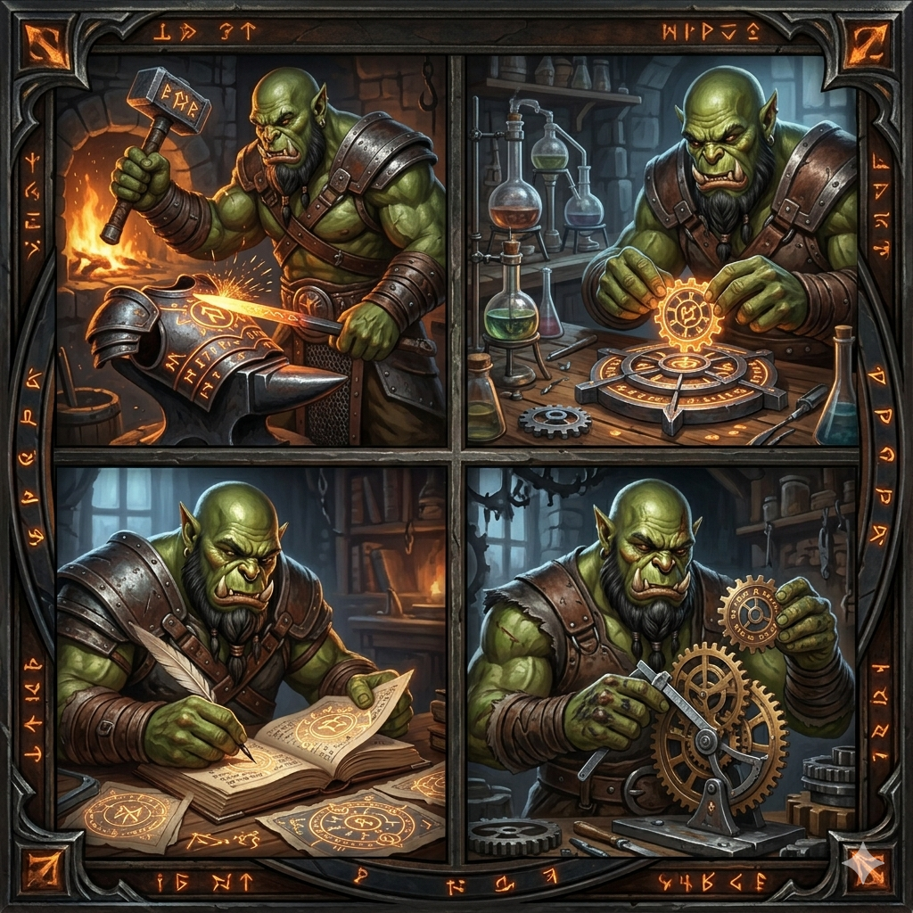
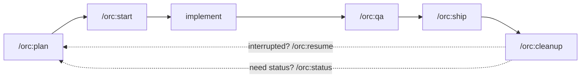

<p align="center">
  
</p>

<h1 align="center">orc</h1>

<p align="center">
  <strong>"Zug zug."</strong>
</p>

<p align="center">
  <em>Let the orcs do the work.</em>
</p>

<p align="center">
  A personal Claude Code plugin for the senior-developer day —
  <em>plan → debug → verify → ship</em> — with curated skills, composite commands,
  and a senior-dev agent that writes the code while you mind the gates.
</p>

## What it does

`orc` is a personal-workflow plugin: **54 curated skills, 19 composite slash commands, 10 specialist subagents, and 3 hook scripts** that quietly enforce discipline (no commits to `main`, dependency pre-flight check, skill catalog injected at every session start). One umbrella command — **`/orc:flow`** — drives the full feature lifecycle from "I want to do X" to "PR merged" with `orc-implementer` writing the code slice-by-slice in between.

It exists for one reason: every time a senior developer sits down to work, they should already know how the next hour goes — write the plan, watch the test fail, fix the cause (not the symptom), verify with evidence, ship the PR. orc encodes that loop.

## Mental model

orc maps the senior IC / tech-lead / architect day to a small set of composite commands. Most work fits this loop:



**Outside the loop** — reach for these directly when the situation isn't a fresh feature pipeline:

| Situation | Command |
|-----------|---------|
| Debugging a known bug | `/orc:debug` |
| Reviewing someone else's PR | `/orc:code-review` |
| Responding to your PR's review comments | `/orc:address` |
| Authoring a Product Requirements Document | `/orc:prd` |
| Authoring a Technical Requirements Document | `/orc:trd` |
| Locking in an architectural decision | `/orc:adr` |
| Proposing a system design before code | `/orc:rfc` |
| Writing an incident postmortem | `/orc:postmortem` |
| Bootstrapping a new package/service | `/orc:scaffold` |
| Parallel-dispatching N independent tasks | `/orc:fan-out` |
| Filing/linking a Jira ticket from the terminal | `/orc:jira` |

Or skip the per-phase invocations and use **`/orc:flow`** to drive the whole loop — gates at every phase, autonomous implementation in between via `orc-implementer`.

## Common scenarios — pick one

| You have ... | Read |
|--------------|------|
| A whole feature/bug to drive end-to-end | [examples/00 — End-to-end with /orc:flow](./examples/00-end-to-end-flow.md) |
| A reproducible bug or failing test | [examples/01 — Fixing a bug](./examples/01-fixing-a-bug.md) |
| Just had a production incident | [examples/02 — Writing a postmortem](./examples/02-incident-postmortem.md) |
| A new feature to ship | [examples/03 — Adding a new feature](./examples/03-adding-a-new-feature.md) |
| A new package/service or doc gap | [examples/04 — Writing documentation](./examples/04-writing-documentation.md) |
| A PRD from PM | [examples/05 — Handling a PRD](./examples/05-handling-a-prd.md) |
| Someone else's open PR | [examples/06 — Reviewing someone's PR](./examples/06-reviewing-someones-pr.md) |
| Reviewer comments on your PR | [examples/07 — Responding to PR feedback](./examples/07-responding-to-pr-feedback.md) |
| A non-trivial architectural decision | [examples/08 — Writing an ADR](./examples/08-writing-an-adr.md) |
| A multi-week design needing critique | [examples/09 — Writing an RFC](./examples/09-writing-an-rfc.md) |
| A web change ready to ship | [examples/10 — Web QA before shipping](./examples/10-web-qa-before-shipping.md) |
| Multiple teammates' PRs to review (or any N independent tasks) | [examples/11 — Multi-PR review with /orc:fan-out](./examples/11-multi-pr-review.md) |
| A Jira ticket to link to a session and close on PR merge | [examples/12 — Linking a Jira ticket and shipping with `Resolves <KEY>`](./examples/12-link-jira-and-ship.md) |

Each example follows the same shape — *Scenario → Flow → Walk-through → Artifacts → Done when → Variants → Iron rules in play* — so you can scan to the relevant section.

## Install

### Via the marketplace (recommended for friends / clean machines)

orc is published as a single-plugin marketplace at this repo. Inside Claude Code:

```
/plugin marketplace add HigorAlves/orc
/plugin install orc@orc
```

The first command registers `https://github.com/HigorAlves/orc` as a marketplace named `orc`; the second installs the `orc` plugin from it. Updates pull with `/plugin update orc@orc`.

To pin a specific commit/tag, use the longhand source form in `~/.claude/settings.json`:

```jsonc
{
  "extraKnownMarketplaces": {
    "orc": {
      "source": {
        "source": "url",
        "url": "https://github.com/HigorAlves/orc.git",
        "ref": "v0.1.0"
      }
    }
  },
  "enabledPlugins": { "orc@orc": true }
}
```

> The plugin uses an HTTPS clone URL explicitly so installation works on machines without GitHub SSH keys configured. If you have `git config --global url.git@github.com:.insteadOf https://github.com/` set, that rewrite will hit this URL too — temporarily disable the rewrite, or use the local plugin-dir flow below.

### Via local plugin-dir (recommended for development on this repo)

```bash
claude --plugin-dir /Users/higoralves/Developer/system/orc
```

Reload after edits without restarting:

```
/reload-plugins
```

## Requirements

orc's SessionStart pre-flight (`hooks/scripts/session-start-tool-check.sh`) verifies these CLI tools are installed and surfaces a `⚠ Tool check ─────` warning if anything's missing.

| Tool | Tier | Used by |
|------|------|---------|
| `git` | required | every command |
| `jq` | required | hook scripts (parse Bash tool input) |
| `gh` | recommended | `/orc:code-review`, `/orc:address`, `/orc:ship`, `/orc:postmortem` |
| `agent-browser` | recommended | `/orc:qa` (web mode — browser-driven QA evidence) |
| `acli` | recommended | `/orc:jira`, `/orc:plan\|start\|debug\|flow` (Jira ticket linking), `/orc:prd\|trd` (`--from-jira <KEY>` seeding) |

Suppress the check on machines where missing tools are intentional:

```bash
export ORC_SKIP_TOOL_CHECK=1
```

## Environment variables

| Variable | Effect |
|----------|--------|
| `ORC_SKIP_TOOL_CHECK=1` | Suppress the SessionStart `⚠ Tool check` block when a recommended dependency is intentionally missing. |
| `ORC_ALLOW_PROTECTED=1` | Allow `git commit` / `git push` on `main` / `master` / `develop`. The PreToolUse hook refuses by default; this flag opts in for the rare scaffold/hot-fix case. |
| `ORC_JIRA_PR_KEYWORD` | PR-body trailer keyword used by `/orc:ship` when the active session has a bound `jiraTicket`. Defaults to `Resolves`. Set to `Closes` or `Fixes` for orgs whose Jira/GitHub integration uses a different keyword. |

## Day-one command catalog

| Command | Purpose |
|---------|---------|
| **`/orc:flow`** | **Recommended entry point.** Drives the full lifecycle (plan → start → implement → QA → ship → address → cleanup) with an `AskUserQuestion` gate at every phase. Resumable from any phase. |
| `/orc:plan` | Plan a feature/refactor; writes a TDD-shaped plan to `.orc/<branch>/files/` |
| `/orc:start` | Worktree + plan + first failing test (TDD red light) |
| `/orc:debug` | Root-cause investigation, then fix with TDD; never papers over |
| `/orc:qa` | Pre-PR quality gate; for web changes, full browser QA with screenshots/video/steps |
| `/orc:code-review` | Review someone else's open PR; terse, signal-only output |
| `/orc:address` | Answer reviewer comments on YOUR PR; parallel code-fixer + reply-drafter |
| `/orc:ship` | Finalize and open the PR |
| `/orc:fan-out` | Dispatch independent tasks in parallel sub-sessions |
| `/orc:scaffold` | Bootstrap a new package/service with proper README + Diátaxis docs |
| `/orc:resume` | Pick up an interrupted multi-phase command from its checkpoint |
| `/orc:status` | Show all active `.orc/` workspaces |
| `/orc:adr` | Author an Architecture Decision Record (`docs/adr/NNNN-*.md`) |
| `/orc:rfc` | Author a system-design RFC pre-implementation (`docs/rfcs/NNNN-*.md`) |
| `/orc:prd` | Author a Product Requirements Document (`docs/prds/NNNN-*.md`); supports `--interview` and `--from-jira <KEY>` |
| `/orc:trd` | Author a Technical Requirements Document (`docs/trds/NNNN-*.md`); supports `--from-prd NNNN` |
| `/orc:jira` | Manage Jira tickets via `acli` (create/subtask/link/view/search/transition); `bind`/`unbind` a ticket key to the current `.orc/` session |
| `/orc:postmortem` | Author a blameless incident postmortem; files P0 action items as tracker issues |
| `/orc:cleanup` | Remove `.orc/` state, worktree, and (if merged) branch for completed sessions |

## Skill catalog

**Core (18, always available):** `tdd`, `systematic-debugging`, `verification-before-completion`, `writing-plans`, `executing-plans`, `caveman-review`, `caveman-pr`, `receiving-code-review`, `requesting-code-review`, `git-commit`, `gh-cli`, `using-git-worktrees`, `finishing-a-development-branch`, `dispatching-parallel-agents`, `error-handling-patterns`, `git-advanced-workflows`, `architecture-patterns`, `improve-codebase-architecture`.

**Senior/architect practice (5, authored for orc):** `adr-writing` (Architecture Decision Records), `rfc-writing` (system-design RFCs), `postmortem` (blameless incident postmortems), `prd-writing` (Product Requirements Documents), `trd-writing` (Technical Requirements Documents).

**Pack: web-react (7):** `next-best-practices`, `vercel-react-best-practices`, `vercel-composition-patterns`, `frontend-design`, `shadcn`, `tailwind-design-system`, `vitest`.

**Pack: backend (8):** `nodejs-best-practices`, `nestjs-best-practices`, `typescript-advanced-types`, `postgresql-table-design`, `postgresql-optimization`, `postgresql-code-review`, `stripe-best-practices`, `upgrade-stripe`.

**Pack: ios (2):** `swiftui-pro`, `mobile-ios-design`.

**Pack: workflow-extras (13):** `docker-expert`, `turborepo`, `sentry-cli`, `jira-cli`, `inline-review`, `skill-creator`, `write-a-skill`, `documentation-writer`, `create-readme`, `to-prd`, `to-issues`, `grill-me`, `agent-browser` (drives a real browser for `/orc:qa` web mode).

Plus the meta skill `using-orc` (auto-injected at SessionStart, encodes iron rules). **Total: 54 skills.**

## Insight blocks

When orc is writing or modifying code, it surfaces 2–3 short, codebase-specific notes inline using:

```
`★ Insight ─────────────────────────────────────`
[2–3 short, codebase-specific insights]
`─────────────────────────────────────────────────`
```

This is baked into `skills/using-orc/SKILL.md` and injected at every SessionStart, so orc is self-sufficient — no separate explanatory-output-style plugin required.

## Iron rules (enforced by hooks + the using-orc skill)

1. No commits to `main`/`master`/`develop` without `ORC_ALLOW_PROTECTED=1`.
2. No code without a failing test first.
3. No claims without verification (run the command, read the output).
4. No fixes without a found root cause.
5. No AI attribution in code, commits, or PRs.
6. No multi-phase work without `.orc/` checkpoints.

## Web QA evidence is a hard rule

Any web-surface change going through `/orc:qa` MUST produce, in `.orc/<branch>/files/qa/`:

- `screenshot-NN-<step>.png` per visible step (annotated via `agent-browser screenshot --annotate`)
- `snapshot-final.txt` — accessibility tree from `agent-browser snapshot`
- `console.log` — captured browser console (errors flagged)
- `network.har` — network traffic from `agent-browser network har start/stop`
- `steps.md` — narrated golden path + edge cases

Bonus (optional): `trace.json`, `react-renders.json`, `vitals.json`, or an OS-recorded `video.mov` for animated changes. agent-browser does not record video natively.

Without the required artifacts, "QA passed" is not an accepted claim. The `orc-qa-validator` agent — driven by the [vercel-labs/agent-browser](https://github.com/vercel-labs/agent-browser) CLI via the `orc:agent-browser` skill — produces them.

## Layout

```
orc/
├── .claude-plugin/plugin.json   # manifest
├── .orc/                        # gitignored — workspace state per session
├── skills/<name>/SKILL.md       # 54 skills (8 authored + 46 curated)
├── commands/<name>.md           # 19 slash commands (incl. /orc:flow umbrella)
├── agents/orc-<role>.md         # 10 subagents (incl. orc-implementer for /orc:flow Phase 5)
├── hooks/
│   ├── hooks.json
│   └── scripts/                 # session-start-using-orc.sh
│                                # session-start-tool-check.sh
│                                # pre-commit-branch-check.sh
├── lib/                         # shared prompt fragments + templates
├── docs/                        # architecture.md, contributing.md, adr/
├── examples/                    # scenario walk-throughs (start here for usage)
├── skills-database/             # curation source (gitignored, archived pre-publish)
└── skills-old/                  # legacy mirror (gitignored, archived pre-publish)
```

## Development

See `docs/contributing.md` for conventions on adding skills, commands, agents, and hooks.

See `docs/architecture.md` for the why behind the layout and the `.orc/` lifecycle.

## License

MIT — see `LICENSE`.
