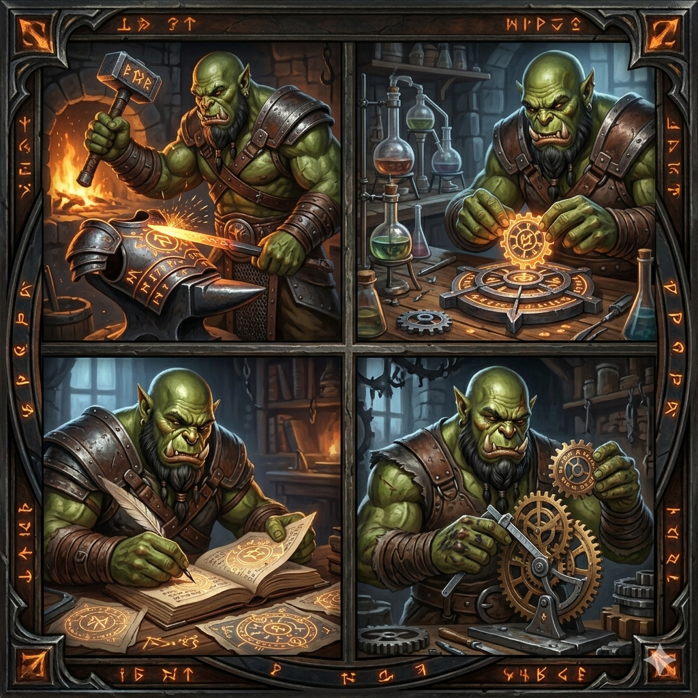
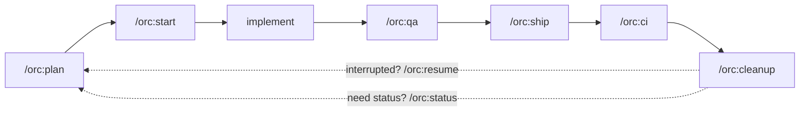

<p align="center">
  
</p>

<h1 align="center">orc</h1>

<p align="center">
  <strong>"Zug zug."</strong> &nbsp;·&nbsp; <em>Let the orcs do the work.</em>
</p>

<p align="center">
  The senior-developer workflow, encoded as a Claude Code plugin —
  <em>plan → debug → verify → ship</em> — with hard guardrails that keep it
  off <code>main</code>, out of your git attribution, and entirely on your own machine.
</p>

<p align="center">
  <em>Built for the senior-developer day. Safe enough for the security review.</em>
</p>

<p align="center">
  <a href="LICENSE"></a>
  
  
  
  
  
</p>

<p align="center">
  <a href="#is-it-safe-to-use"><strong>Is it safe?</strong></a> &nbsp;·&nbsp;
  <a href="#install"><strong>Install</strong></a> &nbsp;·&nbsp;
  <a href="#what-orc-can-do"><strong>Commands</strong></a> &nbsp;·&nbsp;
  <a href="#faq"><strong>FAQ</strong></a> &nbsp;·&nbsp;
  <a href="./examples"><strong>Examples</strong></a>
</p>

<p align="center">
  <code>75 skills</code> &nbsp;·&nbsp; <code>30 commands</code> &nbsp;·&nbsp;
  <code>14 agents</code> &nbsp;·&nbsp; <code>7 guardrail hooks</code> &nbsp;·&nbsp;
  <code>0 telemetry</code> &nbsp;·&nbsp; <code>MIT</code>
</p>

---

`orc` is a full-SDLC workflow plugin for Claude Code: **75 curated skills, 30 composite slash commands, 14 specialist subagents, and 7 hook scripts** that quietly enforce discipline (no commits to `main`, no AI-attribution trailers, destructive git commands gated, a dependency pre-flight, core rules injected at every session start). One umbrella command — **`/orc:flow`** — drives the full feature lifecycle from "I want to do X" to "PR merged", with the `orc-implementer` agent writing the code slice-by-slice in between — and the lifecycle no longer stops at PR-open: `/orc:ci`, `/orc:release`, `/orc:deps`, and `/orc:incident` cover what happens after.

It exists for one reason: every time a senior developer sits down to work, they should already know how the next hour goes — write the plan, watch the test fail, fix the cause (not the symptom), verify with evidence, ship the PR. orc encodes that loop.

## Is it safe to use?

Short answer: **yes — and you can verify every claim below in this repo in about five minutes.** orc is a *workflow layer*, not a service. It has no backend and it does not phone home.

> [!NOTE]
> **What orc is — and isn't.** orc is an MIT-licensed, open-source plugin you run on top of Claude Code and audit yourself. It is **not** a SaaS, not a code host, and makes no SOC2/vendor-SLA claims. "Safe to use" here means *local, guardrailed, and auditable* — not *vendor-backed*.

### It runs on your machine

- **No orc servers. No telemetry. No analytics.** There is no tracking SDK anywhere in the tree — grep for it.
- **Network activity is limited and legible:** GitHub (to fetch the plugin / CLI releases) and any MCP servers *you* explicitly add. Nothing else.
- **Your work-memory is local and git-ignored** (`graphify-out/`) — it never leaves your repo.

### Guardrails enforced by hooks, not vibes

Every rule below is a short, readable shell script under [`orc/hooks/scripts/`](orc/hooks/scripts) that Claude Code runs as a real hook — not a suggestion the model can talk itself out of.

| Guardrail | What it does | Enforced by |
|-----------|--------------|-------------|
| **No commits to protected branches** | Intercepts `git commit` / `git push` on `main`/`master`/`develop` and downgrades them to a one-keystroke confirm prompt — no env-var escape hatch | [`pre-commit-branch-check.sh`](orc/hooks/scripts/pre-commit-branch-check.sh) |
| **Destructive git gated** | Downgrades `git reset --hard`, `git clean -f`, `git branch -D`, and `git push --force` to a confirm prompt (`--force-with-lease` passes untouched) | [`pre-destructive-git-check.sh`](orc/hooks/scripts/pre-destructive-git-check.sh) |
| **No AI attribution in your history** | Refuses `git commit` and `gh pr/issue create/edit` whose text contains `Co-Authored-By: Claude`, `Generated with Claude Code`, the 🤖 marker, or `noreply@anthropic.com` | [`pre-commit-no-ai-attribution.sh`](orc/hooks/scripts/pre-commit-no-ai-attribution.sh) |
| **Dependency pre-flight** | Checks the CLI tools orc relies on at session start and warns (via `systemMessage`) if any are missing | [`session-start-tool-check.sh`](orc/hooks/scripts/session-start-tool-check.sh) |
| **Rules in every session** | Injects the iron rules + skill routing at `SessionStart`, so discipline is loaded before the first action | [`session-start-using-orc.sh`](orc/hooks/scripts/session-start-using-orc.sh) |

### Open and auditable

- **MIT-licensed**, every guardrail and command is plain text you can read and diff.
- **orc's own supply chain is hardened:** its CI runs least-privilege (`permissions: contents: read`), scans every push for secrets ([gitleaks](https://github.com/gitleaks/gitleaks-action)), scans the Go CLI for known vulnerabilities ([govulncheck](https://pkg.go.dev/golang.org/x/vuln/cmd/govulncheck)), lints, and pins its toolchain — so what ships is what you reviewed.
- **Evidence, not adjectives:** web changes going through `/orc:qa` must produce a real artifact packet (screenshots, accessibility snapshot, console log, network HAR, narrated steps) before "QA passed" is an accepted claim.

## What it does

orc maps the senior IC / tech-lead / architect day to a small set of composite commands. Most work fits this loop:


```mermaid
flowchart LR
    plan["/orc:plan"] --> start["/orc:start"] --> impl["implement"] --> qa["/orc:qa"] --> ship["/orc:ship"] --> ci["/orc:ci"] --> cleanup["/orc:cleanup"]
    cleanup -.->|"interrupted? /orc:resume"| plan
    cleanup -.->|"need status? /orc:status"| plan
```

Or skip the per-phase invocations and use **`/orc:flow`** to drive the whole loop — an `AskUserQuestion` gate at every phase, autonomous implementation in between via `orc-implementer`.

**Outside the loop** — reach for these directly when the situation isn't a fresh feature pipeline:

| Situation | Command |
|-----------|---------|
| Debugging a known bug | `/orc:debug` |
| Needing the app running (QA or manual poking) | `/orc:env` |
| Reviewing someone else's PR | `/orc:code-review` |
| Responding to your PR's review comments | `/orc:address` |
| Authoring a PRD / TRD / ADR / RFC | `/orc:prd` · `/orc:trd` · `/orc:adr` · `/orc:rfc` |
| Writing an incident postmortem | `/orc:postmortem` |
| Bootstrapping a new package/service | `/orc:scaffold` |
| Parallel-dispatching N independent tasks | `/orc:fan-out` |
| Filing/linking a Jira ticket from the terminal | `/orc:jira` |
| A feature to break into a Jira Epic→Story→Task hierarchy | `/orc:jira-breakdown` |
| Collecting browser evidence for a ticket | `/orc:evidence` |
| Production incident happening right now | `/orc:incident` |
| Dependencies stale or vulnerable | `/orc:deps` |
| Cutting a release (semver, changelog, tag) | `/orc:release` |
| Issue backlog to herd into agent-ready briefs | `/orc:triage` |
| Work too big for one session | `/orc:wayfinder` |
| First-time repo setup (tracker, labels, domain docs) | `/orc:setup` |
| Not sure which of these? | `orc:map` — the router |

## Common scenarios — pick one

| You have ... | Read |
|--------------|------|
| A whole feature/bug to drive end-to-end | [examples/00 — End-to-end with /orc:flow](./examples/00-end-to-end-flow.md) |
| A reproducible bug or failing test | [examples/01 — Fixing a bug](./examples/01-fixing-a-bug.md) |
| Just had a production incident | [examples/02 — Writing a postmortem](./examples/02-incident-postmortem.md) |
| A new feature to ship | [examples/03 — Adding a new feature](./examples/03-adding-a-new-feature.md) |
| A new package/service or doc gap | [examples/04 — Writing documentation](./examples/04-writing-documentation.md) |
| A PRD from PM | [examples/05 — Handling a PRD](./examples/05-handling-a-prd.md) |
| Someone else's open PR | [examples/06 — Reviewing someone's PR](./examples/06-reviewing-someones-pr.md) |
| Reviewer comments on your PR | [examples/07 — Responding to PR feedback](./examples/07-responding-to-pr-feedback.md) |
| A non-trivial architectural decision | [examples/08 — Writing an ADR](./examples/08-writing-an-adr.md) |
| A multi-week design needing critique | [examples/09 — Writing an RFC](./examples/09-writing-an-rfc.md) |
| A web change ready to ship | [examples/10 — Web QA before shipping](./examples/10-web-qa-before-shipping.md) |
| Multiple teammates' PRs to review (or any N independent tasks) | [examples/11 — Multi-PR review with /orc:fan-out](./examples/11-multi-pr-review.md) |
| A Jira ticket to link and close on PR merge | [examples/12 — Linking a Jira ticket and shipping](./examples/12-link-jira-and-ship.md) |
| CI red on the PR you just opened | [examples/13 — Fixing red CI](./examples/13-fixing-red-ci.md) |
| Production incident happening right now | [examples/14 — Live incident response](./examples/14-live-incident.md) |
| Dependency hygiene day (vulns, outdated packages) | [examples/15 — Dependency audit and upgrade](./examples/15-dependency-audit.md) |
| A release to cut | [examples/16 — Cutting a release](./examples/16-cutting-a-release.md) |
| A repo joining orc, then daily issue triage | [examples/17 — Tracker setup and triage](./examples/17-tracker-setup-and-triage.md) |

Each example follows the same shape — *Scenario → Flow → Walk-through → Artifacts → Done when → Variants → Iron rules in play* — so you can scan to the relevant section.

## Install

orc ships in **two layers**, and it helps to keep them straight:

- **The `orc` CLI** — a small local Go tool you install on *your machine*.
- **The `orc` plugin** — what actually adds the `/orc:*` commands *inside Claude Code*.

You install the CLI once; the CLI then installs and configures the plugin for you. **This tutorial walks you from zero to a working setup, one step at a time.** Prefer to skip the CLI? Jump to [the marketplace path](#prefer-the-plugin-marketplace-directly-no-cli).

> [!NOTE]
> **Prerequisites.** macOS or Linux (Intel/AMD or Apple Silicon/ARM), plus [Claude Code](https://claude.com/claude-code) with its `claude` CLI on your `PATH`. You do **not** need `git` or `jq` beforehand — step 2 installs them. (If the `claude` CLI isn't on `PATH`, step 3 still works: it writes `~/.claude/settings.json` directly.)

### 1. Install the orc CLI

```bash
curl -fsSL https://raw.githubusercontent.com/HigorAlves/orc/main/cli/install.sh | sh
```

This detects your OS and architecture, resolves the latest release, downloads it from GitHub Releases, and verifies it against `checksums.txt`. Confirm it landed:

```bash
orc version
```

**You should see** a semantic version (e.g. `0.10.0`) — **not** the word `dev`. That confirms you got a real release build.

> [!TIP]
> **Prefer Go?** `go install github.com/HigorAlves/orc/cli/cmd/orc@latest` (requires Go ≥ 1.25.8). A source build injects no version metadata, so `orc version` prints `dev` — that's expected. **Homebrew** is on the way: once the `HigorAlves/homebrew-tap` cask is published, `brew install --cask HigorAlves/tap/orc` will be the one-liner. See [Other ways to install](#other-ways-to-install-the-cli).

### 2. Install the runtime tools orc needs

```bash
orc doctor --fix
```

Checks the tools orc relies on and installs any that are missing via your system package manager. **You should see** `git` and `jq` reported present — these two are **required** (`orc doctor` exits non-zero if either is missing). It also offers the **recommended** set (`gh`, `agent-browser`, `acli`, `docker`, `graphify`, `osv-scanner`, `gitleaks`, `sentry-cli`); those aren't required, but individual commands use them.

> [!TIP]
> Running unattended (CI, dotfiles)? Add `-y` to skip prompts: `orc doctor --fix -y`. Just want to check without installing? Run `orc doctor` on its own.

### 3. Register the marketplace and enable the plugin

```bash
orc install
```

Registers the `orc` marketplace and enables the `orc@orc` plugin. When the `claude` CLI is on your `PATH`, orc drives it; otherwise it writes the same entries into `~/.claude/settings.json` directly.

> [!TIP]
> Pin a specific version: `orc install --ref orc--v0.16.0` (any existing release tag, or a commit SHA). Using `--ref` writes `settings.json` directly.

### 4. Load the plugin in Claude Code

Plugin commands load at startup. **Restart Claude Code** — or, in an open session, run `/reload-plugins`.

### 5. Verify it worked

Inside Claude Code, run `/plugin`. **You should see** `orc@orc` listed and enabled. Now type `/orc:` at the prompt — **you should see** the command palette populate (`/orc:flow`, `/orc:plan`, `/orc:ship`, …). That's the whole setup live.

Optionally, initialize per-repo state (run **inside a git repo**, or a workspace directory holding 2+ repos):

```bash
orc init
```

**You should see** an `.orc/` directory created (with `orc.json` + `pr-budget.json`, and `.orc/` added to your gitignore). This is optional — commands that need it will offer to create it.

**Done.** From zero to a verified, working orc. Head to [What orc can do](#what-orc-can-do) to pick your first command.

---

### Other ways to install the CLI

Reference alternatives to step 1. After either, **continue the tutorial from step 2** (`orc doctor --fix`).

**From source (`go install`)** — requires Go ≥ 1.25.8:

```bash
go install github.com/HigorAlves/orc/cli/cmd/orc@latest
```

**One-line bootstrap options.** The `curl | sh` installer honors two env overrides: `ORC_VERSION` (a release tag; default is latest) and `ORC_BIN_DIR` (install dir; defaults to `/usr/local/bin`, falling back to `~/.local/bin` when that's absent or unwritable). It needs `curl`, `tar`, and `shasum`/`sha256sum`.

**Homebrew (planned).** goreleaser is configured to publish a cask to `HigorAlves/homebrew-tap` on each release; once that tap repo exists, `brew install --cask HigorAlves/tap/orc` becomes available (the cask's macOS post-install hook strips the `com.apple.quarantine` attribute so the unsigned binary runs without a Gatekeeper prompt).

### Prefer the plugin marketplace directly (no CLI)

You don't have to install the CLI at all. orc is published as a single-plugin marketplace at this repo, so you can enable it entirely from **inside Claude Code**:

```
/plugin marketplace add HigorAlves/orc
/plugin install orc@orc
```

The first command registers `https://github.com/HigorAlves/orc` as a marketplace named `orc`; the second installs the plugin. Pull updates with `/plugin update orc@orc`.

To pin a specific tag or commit, use the longhand source form in `~/.claude/settings.json`:

```jsonc
{
  "extraKnownMarketplaces": {
    "orc": {
      "source": {
        "source": "url",
        "url": "https://github.com/HigorAlves/orc.git",
        "ref": "orc--v0.16.0"
      }
    }
  },
  "enabledPlugins": { "orc@orc": true }
}
```

> [!NOTE]
> **Trade-off vs. the CLI.** The marketplace path installs the *plugin only* — it does **not** check or install the runtime tools (`git`, `jq`, and the recommended set) that many commands depend on. Run `orc doctor` afterward, or install those tools yourself.
>
> The plugin uses an HTTPS clone URL so it works on machines without GitHub SSH keys. If you have `git config --global url."git@github.com:".insteadOf "https://github.com/"` set, that rewrite will also hit this URL — temporarily disable it if the install fails.

## What orc can do

### Commands (30)

| Command | Purpose |
|---------|---------|
| **`/orc:flow`** | **Recommended entry point.** Drives the full lifecycle (plan → start → implement → QA → ship → address → cleanup) with a gate at every phase. Resumable from any phase. |
| `/orc:plan` | Plan a feature/refactor; writes a TDD-shaped plan to `.orc/<branch>/files/` |
| `/orc:start` | Worktree + plan + first failing test (TDD red light) |
| `/orc:debug` | Root-cause investigation, then fix with TDD; never papers over |
| `/orc:qa` | Pre-PR quality gate; for web changes, full browser QA with screenshots/snapshot/HAR/steps |
| `/orc:env` | Provision a containerized dev environment; `up`/`status`/`down`; reused across QA runs |
| `/orc:code-review` | Review someone else's open PR; terse, signal-only output |
| `/orc:address` | Answer reviewer comments on YOUR PR; parallel code-fixer + reply-drafter |
| `/orc:ship` | Finalize and open the PR (soft size-budget gate) |
| `/orc:stack-pr` | Split a too-big branch into a stack of smaller chained PRs |
| `/orc:fan-out` | Dispatch independent tasks in parallel sub-sessions |
| `/orc:scaffold` | Bootstrap a new package/service with README + Diátaxis docs |
| `/orc:resume` | Pick up an interrupted multi-phase command from its checkpoint |
| `/orc:status` | Show all active `.orc/` workspaces |
| `/orc:adr` · `/orc:rfc` | Author an ADR / a system-design RFC |
| `/orc:prd` · `/orc:trd` | Author a PRD / a TRD (supports `--from-jira` / `--from-prd`) |
| `/orc:jira` | Manage Jira tickets via `acli`; bind/unbind a ticket to the current session |
| `/orc:jira-breakdown` | Build a Jira Epic (micro-PRD) → Stories → concurrency-sliced Tasks from a brief or PRD |
| `/orc:evidence` | Collect browser evidence scoped to a ticket, then upload or keep local |
| `/orc:postmortem` | Author a blameless incident postmortem; files P0 items as tracker issues |
| `/orc:ci` | Watch + diagnose CI after PR-open; classified failures routed to `orc-code-fixer` |
| `/orc:incident` | Live incident triage — Sentry intake, mitigate-vs-root-cause gate, UTC timeline |
| `/orc:deps` | Dependency audit / outdated / upgrade — one bump per commit, majors escalated |
| `/orc:release` | Cut a user-project release: semver from commits, changelog, tag, GitHub release |
| `/orc:setup` | Run-once tracker/labels/domain-docs interview; powers to-issues, triage, wayfinder |
| `/orc:triage` | Herd issues + external PRs through triage roles into agent-ready briefs |
| `/orc:wayfinder` | Plan multi-session work as decision tickets on the tracker |
| `/orc:cleanup` | Remove `.orc/` state, worktree, and (if merged) branch for completed sessions |

### Specialist agents (14)

`orc-implementer` (writes code slice-by-slice), `orc-debug-investigator`, `orc-test-author`, `orc-code-fixer`, `orc-pr-reviewer`, `orc-security-reviewer`, `orc-ci-investigator`, `orc-qa-validator`, `orc-env-provisioner`, `orc-prd-analyzer`, `orc-refactor-architect`, `orc-jira-architect`, `orc-reply-drafter`, `orc-stack-analyzer` — each a read-only investigator or a scoped executor, dispatched by the commands above. Every agent pins both a `model` (haiku for mechanical work, sonnet for senior-dev execution, opus for deep investigation) and a reasoning `effort` matched to its task shape.

### Skills (75)

Under the commands and agents sit 75 curated skills — reusable, progressively-disclosed playbooks the model pulls in on demand: process doctrine (`tdd`, `systematic-debugging`, `verification-before-completion`, `grilling`, `codebase-design`, `domain-modeling`), stack packs (Next.js, NestJS, PostgreSQL, SwiftUI, Tailwind, Turborepo, …), authoring guides (PRD/TRD/ADR/RFC/postmortem), and the `orc:map` router when you're not sure which to reach for. Fifteen are vendored or merged from [mattpocock/skills](https://github.com/mattpocock/skills) and other MIT sources with full provenance ([THIRD-PARTY-LICENSES.md](THIRD-PARTY-LICENSES.md)); their descriptions are deliberately differentiated so co-installing the originals doesn't double-trigger. Each skill is a thin index that loads its detail only when invoked, so they cost almost nothing until used. **Total: 75 skills.**

### The orc CLI

A small Go / [Bubble Tea](https://github.com/charmbracelet/bubbletea) TUI that installs and configures everything. Every command runs non-interactively too (`--yes`/`--json`), so it fits CI:

```bash
orc                       # interactive menu (install, doctor, config, MCP, tools)
orc install               # register marketplace + enable the plugin
orc doctor --fix          # check and install missing runtime tools
orc config set pr_size_budget 500
orc mcp add github --token "$GITHUB_TOKEN"   # known: github, jira, sentry, vercel, graphify
orc update                # update to latest (or --to <ref> to repin)
```

See [`cli/README.md`](cli/README.md) for the full command reference.

## Requirements

orc's SessionStart pre-flight (`session-start-tool-check.sh`) verifies these CLI tools and, if anything's missing, delivers an "orc tool check" callout to you via `systemMessage`.

| Tool | Tier | Used by |
|------|------|---------|
| `git` | required | every command |
| `jq` | required | hook scripts (parse Bash tool input) |
| `gh` | recommended | `/orc:code-review`, `/orc:address`, `/orc:ship`, `/orc:postmortem` |
| `agent-browser` | recommended | `/orc:qa` (web mode — browser-driven QA evidence) |
| `acli` | recommended | `/orc:jira`, Jira ticket linking, PRD/TRD `--from-jira` seeding |
| `docker` | recommended | `/orc:env`, `/orc:qa` / `/orc:flow` env provisioning (host-mode fallback applies without it) |
| `graphify` | recommended | `/orc:plan`, `/orc:start`, `/orc:flow`, `/orc:debug` — code discovery via a code graph instead of grep |
| `osv-scanner` | recommended | `/orc:deps` — ecosystem-agnostic vulnerability audit (per-ecosystem scanners as fallback) |
| `gitleaks` | recommended | `/orc:code-review --audit` — secret scanning (regex fallback without it) |
| `sentry-cli` | recommended | `/orc:incident` — pull Sentry issues/events into live triage |

Suppress the check where missing tools are intentional: `export ORC_SKIP_TOOL_CHECK=1`.

## Configuration

### Plugin settings (`userConfig`)

Prompted at plugin enable time (re-run via `/plugin`); exported to hooks and libs as `CLAUDE_PLUGIN_OPTION_<KEY>`:

| Setting | Default | Effect |
|---------|---------|--------|
| `pr_size_budget` | `300` | Soft LOC budget for the ship/flow/stack-pr size gate (per-repo `.orc/pr-budget.json` still wins). |
| `protected_branches` | `main,master,develop` | Branches guarded by the confirm-to-commit hook. |
| `skip_tool_check` | `false` | Skip the SessionStart CLI dependency pre-flight. |
| `learn_from_outcomes` | `true` | Record verified debug outcomes into the local Graphify work-memory (`graphify-out/`, git-ignored) so code discovery improves across sessions. No effect when Graphify is absent. |

### Environment variables

| Variable | Effect |
|----------|--------|
| `ORC_SKIP_TOOL_CHECK=1` | Suppress the SessionStart tool-check callout when a recommended dependency is intentionally missing. |
| `ORC_ALLOW_AI_ATTRIBUTION=1` | Allow AI-attribution trailers in commits/PR bodies. The PreToolUse hook refuses them by default (iron rule #5). Set only with explicit user consent. |
| `ORC_JIRA_PR_KEYWORD` | PR-body trailer keyword used by `/orc:ship` when the session has a bound Jira ticket. Defaults to `Resolves`. |

The `orc config` CLI edits these tunables (`pr_size_budget`, `protected_branches`, `skip_tool_check`, `allow_ai_attribution`, `jira_pr_keyword`) as `ORC_*` variables in `settings.json`.

## Iron rules (enforced by hooks + the `using-orc` skill)

1. No commits to `main`/`master`/`develop` — the PreToolUse hook downgrades them to a confirm prompt; approve only with explicit consent.
2. No code without a failing test first.
3. No claims without verification (run the command, read the output).
4. No fixes without a found root cause.
5. No AI attribution in code, commits, or PRs.
6. No multi-phase work without `.orc/` checkpoints.
7. No silent broadcast in workspace mode — repo-touching commands need an explicit target flag or a confirming prompt.
8. No PR over the size budget (default 300 LOC) without a recorded choice — stack it, record a `Size-budget-override:` trailer, or abort.

## Designed to stay lean

Claude Code loads every skill/command/agent **description** at session start (that's how it routes you), but loads a skill's **body** only when invoked. orc is built around that split, so it costs almost nothing until you reach for it:

- **Thin always-on core.** The `using-orc` rules injected at every SessionStart are ~3.5 KB — iron rules + routing only; the full catalog is not re-listed (Claude Code already loads it natively).
- **Progressive disclosure.** Large reference skills are a short index plus `references/*.md` loaded on demand — invoking one pulls only the topic you need.
- **One-line descriptions.** Every skill/command description is a ≤200-char trigger; the detail lives in the body.

Net: a fresh orc session pays only a few thousand baseline tokens before you type anything.

## FAQ

<details>
<summary><strong>Does orc send my code or prompts to any "orc" server?</strong></summary>

No. There is no orc backend and no telemetry — nothing in the tree tracks usage. Your prompts and code go only where Claude Code itself sends them. orc's own network activity is limited to GitHub (fetching the plugin / CLI releases) and any MCP servers you explicitly add.
</details>

<details>
<summary><strong>Can orc commit to <code>main</code> or force-push without me?</strong></summary>

No. A PreToolUse hook (`pre-commit-branch-check.sh`) intercepts `git commit`/`git push` on `main`/`master`/`develop` and downgrades them to a confirm prompt that needs your keystroke — with no env-var escape hatch. The protected branch list is configurable (`protected_branches`). A second hook (`pre-destructive-git-check.sh`) applies the same confirm-prompt gate to `git reset --hard`, `git clean -f`, `git branch -D`, and `git push --force` on any branch.
</details>

<details>
<summary><strong>Will orc put "Generated by AI" or <code>Co-Authored-By</code> in our git history?</strong></summary>

No. A hook (`pre-commit-no-ai-attribution.sh`) refuses any `git commit` or `gh pr/issue create/edit` whose text contains AI-attribution markers. Your history reads as your team's work. (An `ORC_ALLOW_AI_ATTRIBUTION=1` opt-in exists for teams that *want* the trailers.)
</details>

<details>
<summary><strong>What does orc install on a developer's machine?</strong></summary>

The plugin itself is markdown + shell scripts loaded by Claude Code. Optionally, the `orc` CLI is a single static Go binary. Runtime tools (`git`, `jq`, and the recommended set) are installed only when you run `orc doctor --fix`, via your own package manager — orc never bundles or side-loads binaries.
</details>

<details>
<summary><strong>How do we pin and audit a specific version?</strong></summary>

Pin the marketplace `ref` (in `settings.json`, or via `orc install --ref`) to any existing release tag or a commit SHA. CLI releases are tagged `vX.Y.Z` and published by goreleaser with a `checksums.txt`. Everything that runs is plain text in this repo — clone a tag and diff it.
</details>

<details>
<summary><strong>Who maintains it, and is it "production-grade"?</strong></summary>

orc is an open-source personal project (MIT), maintained in the open and used daily by its author. Its CI gates every change with tests, lint, secret scanning (gitleaks), and Go vulnerability scanning (govulncheck). It is not a vendor product with an SLA — "safe to use" means *auditable, local, and guardrailed*, so you can adopt it on your own terms.
</details>

## Layout

```
orc/
├── .claude-plugin/plugin.json   # manifest (v0.16.0)
├── .orc/                        # gitignored — workspace state per session
├── skills/<name>/SKILL.md       # 75 skills — a thin index per skill
│   └── <name>/references/*.md   #   lazy-loaded detail for large skills
├── commands/<name>.md           # 30 slash commands (incl. /orc:flow umbrella)
├── agents/orc-<role>.md         # 14 subagents (incl. orc-implementer)
├── hooks/
│   ├── hooks.json
│   └── scripts/                 # session-start-using-orc.sh
│                                # session-start-tool-check.sh
│                                # pre-commit-branch-check.sh
│                                # pre-commit-no-ai-attribution.sh
│                                # pre-destructive-git-check.sh
│                                # worktree-create.sh
│                                # worktree-remove.sh
├── lib/                         # shared bash helpers (workspace-detect, pr-size-budget)
cli/                             # the orc CLI (Go / Bubble Tea)
docs/                            # architecture.md, contributing.md, roadmap.md
examples/                        # scenario walk-throughs (start here for usage)
```

## Development

See [`docs/contributing.md`](docs/contributing.md) for conventions on adding skills, commands, agents, and hooks, and [`docs/architecture.md`](docs/architecture.md) for the why behind the layout and the `.orc/` lifecycle.

Developing on this repo? Load the plugin straight from your checkout instead of the marketplace:

```bash
claude --plugin-dir /path/to/your/clone/of/orc
```

Reload after edits without restarting: `/reload-plugins`.

## License

MIT — see [`LICENSE`](LICENSE).

<p align="center"><sub><strong>Zug zug.</strong> Let the orcs do the work.</sub></p>
