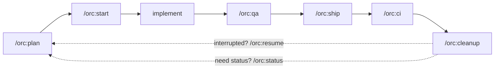

<p align="center">
  
</p>

<h1 align="center">orc</h1>

<p align="center">
  <strong>"Zug zug."</strong> &nbsp;·&nbsp; <em>Let the orcs do the work.</em>
</p>

<p align="center">
  The senior-developer workflow, encoded as a Claude Code plugin —
  <em>plan → debug → verify → ship</em> — with hard guardrails that keep it
  off <code>main</code>, out of your git attribution, and entirely on your own machine.
</p>

<p align="center">
  <em>Built for the senior-developer day. Safe enough for the security review.</em>
</p>

<p align="center">
  <a href="LICENSE"></a>
  
  
  
  
  
</p>

<p align="center">
  <a href="#is-it-safe-to-use"><strong>Is it safe?</strong></a> &nbsp;·&nbsp;
  <a href="#install"><strong>Install</strong></a> &nbsp;·&nbsp;
  <a href="./docs/commands.md"><strong>Commands</strong></a> &nbsp;·&nbsp;
  <a href="./docs/safety.md#faq"><strong>FAQ</strong></a> &nbsp;·&nbsp;
  <a href="./docs/examples/README.md"><strong>Examples</strong></a>
</p>

<p align="center">
  <code>80 skills</code> &nbsp;·&nbsp; <code>30 commands</code> &nbsp;·&nbsp;
  <code>14 agents</code> &nbsp;·&nbsp; <code>9 hooks</code> &nbsp;·&nbsp;
  <code>0 telemetry</code> &nbsp;·&nbsp; <code>MIT</code>
</p>

---

`orc` is a full-SDLC workflow plugin for Claude Code: **80 curated skills, 30 composite slash commands, 14 specialist subagents, and 9 hook scripts** that quietly enforce discipline (no commits to `main`, no AI-attribution trailers, destructive git commands gated, a dependency pre-flight, core rules injected at every session start). One umbrella command — **`/orc:flow`** — drives the full feature lifecycle from "I want to do X" to "PR merged", with the `orc-implementer` agent writing the code slice-by-slice in between — and the lifecycle no longer stops at PR-open: `/orc:ci`, `/orc:release`, `/orc:deps`, and `/orc:incident` cover what happens after.

It exists for one reason: every time a senior developer sits down to work, they should already know how the next hour goes — write the plan, watch the test fail, fix the cause (not the symptom), verify with evidence, ship the PR. orc encodes that loop.

## Is it safe to use?

**Yes — and you can verify every claim in this repo in about five minutes.** orc is a *workflow layer*, not a service: no backend, no telemetry, no analytics. Network activity is limited to GitHub (fetching releases) and any MCP servers *you* add. Every guardrail is a short, readable shell script that Claude Code runs as a real hook — not a suggestion the model can talk itself out of: protected-branch commits and destructive git downgraded to confirm prompts, AI-attribution trailers refused outright, dependencies pre-flighted, the iron rules injected at every session start.

The full claim-by-claim breakdown — guardrail table, supply-chain hardening, FAQ — is in [docs/safety.md](./docs/safety.md).

## What it does

orc maps the senior IC / tech-lead / architect day to a small set of composite commands. Most work fits this loop:


```mermaid
flowchart LR
    plan["/orc:plan"] --> start["/orc:start"] --> impl["implement"] --> qa["/orc:qa"] --> ship["/orc:ship"] --> ci["/orc:ci"] --> cleanup["/orc:cleanup"]
    cleanup -.->|"interrupted? /orc:resume"| plan
    cleanup -.->|"need status? /orc:status"| plan
```

Or skip the per-phase invocations and use **`/orc:flow`** to drive the whole loop — a gate at every phase, autonomous implementation in between via `orc-implementer`, and an `interaction_policy` ladder (`manual`/`guided`/`auto`) that decides how often it asks.

**Outside the loop**, commands cover the rest of the day:

- **Fix & review** — `/orc:debug` (root-cause first), `/orc:code-review`, `/orc:address`, `/orc:stack-pr`, `/orc:fan-out`
- **Author** — `/orc:prd` · `/orc:trd` · `/orc:adr` · `/orc:rfc` · `/orc:postmortem` · `/orc:scaffold`
- **Operate** — `/orc:env`, `/orc:incident`, `/orc:deps`, `/orc:release`, `/orc:ci`
- **Track** — `/orc:jira`, `/orc:jira-breakdown`, `/orc:evidence`, `/orc:setup`, `/orc:triage`, `/orc:wayfinder`
- **Sessions** — `/orc:resume`, `/orc:status`, `/orc:cleanup` — multi-phase work checkpoints to `.orc/` and survives interruption

The full command table, the 14 agents behind it, and the 80-skill library live in [docs/commands.md](./docs/commands.md). Prefer learning by scenario? [docs/examples](./docs/examples/README.md) walks 18 real situations end-to-end.

## Install

Three commands from zero to working:

```bash
curl -fsSL https://raw.githubusercontent.com/HigorAlves/orc/main/cli/install.sh | sh   # 1. the orc CLI
orc doctor --fix                                                                       # 2. runtime tools (git, jq, + recommended)
orc install                                                                            # 3. register marketplace + enable plugin
```

Then **restart Claude Code** (or `/reload-plugins`) and type `/orc:` — the command palette should populate. That's the whole setup.

> [!TIP]
> Pin a version with `orc install --ref orc--v0.21.0`, install without the CLI (`/plugin marketplace add HigorAlves/orc`), or build from source — the step-by-step guide with verification checkpoints, the marketplace-only path, and the full requirements table are in [docs/install.md](./docs/install.md).

## Statusline

While orc is enabled, Claude Code's status bar shows the work and the machine at a glance — no configuration needed (the plugin ships the default; your own `statusLine` always wins):

```
orc flow 6/9 implement │ PROJ-142 │ slices 3/7 │ auto │ ⎇ feat/checkout-retry* │ #128 ✔ approved
Opus 4.5 high think │ ctx ▓▓▓▓▓▓▓░░░ 68% │ $4.83 +412/−88 │ 5h 71%
```

Line 1 is the work: live orc session, Jira ticket, slice progress, autopilot level, branch, and the open PR with its review state. Line 2 is the machine: model + effort, an honest context bar, session cost, and your worst rate limit past 50%. It adapts to terminal width, honors `NO_COLOR`, and never breaks a render — and it feeds a context-monitor bridge that nudges the agent to checkpoint when context runs red. Tuning knobs in [docs/configuration.md](./docs/configuration.md#statusline).

## Iron rules (enforced by hooks + the `using-orc` skill)

1. No commits to `main`/`master`/`develop` — the PreToolUse hook downgrades them to a confirm prompt; approve only with explicit consent.
2. No code without a failing test first.
3. No claims without verification (run the command, read the output).
4. No fixes without a found root cause.
5. No AI attribution in code, commits, or PRs.
6. No multi-phase work without `.orc/` checkpoints.
7. No silent broadcast in workspace mode — repo-touching commands need an explicit target flag or a confirming prompt.
8. No PR over the size budget (default 300 LOC) without a recorded choice — stack it, record a `Size-budget-override:` trailer, or abort.

## Designed to stay lean

Claude Code loads every skill/command/agent **description** at session start (that's how it routes you), but loads a skill's **body** only when invoked. orc is built around that split: a ~3.5 KB always-on core (iron rules + routing), progressive disclosure for large reference skills, ≤200-char descriptions everywhere. Net: a fresh orc session pays only a few thousand baseline tokens before you type anything.

## Docs

| Page | What's in it |
|------|--------------|
| [docs/install.md](./docs/install.md) | Step-by-step install with verification checkpoints, marketplace-only path, requirements table |
| [docs/commands.md](./docs/commands.md) | Full command table, the specialist agents, the skill library, the CLI reference |
| [docs/examples](./docs/examples/README.md) | 18 scenario walk-throughs — start here for usage |
| [docs/configuration.md](./docs/configuration.md) | Plugin settings, env vars, statusline tuning |
| [docs/safety.md](./docs/safety.md) | The safety case in depth + FAQ |
| [docs/architecture.md](./docs/architecture.md) | Why the layout is what it is; hooks, state, and the `.orc/` lifecycle |
| [docs/contributing.md](./docs/contributing.md) | Adding skills, commands, agents, and hooks |

## Development

See [`docs/contributing.md`](docs/contributing.md) for conventions and [`docs/architecture.md`](docs/architecture.md) for the why behind the layout. Developing on this repo? Load the plugin straight from your checkout instead of the marketplace:

```bash
claude --plugin-dir /path/to/your/clone/of/orc
```

Reload after edits without restarting: `/reload-plugins`.

## License

MIT — see [`LICENSE`](LICENSE).

<p align="center"><sub><strong>Zug zug.</strong> Let the orcs do the work.</sub></p>
