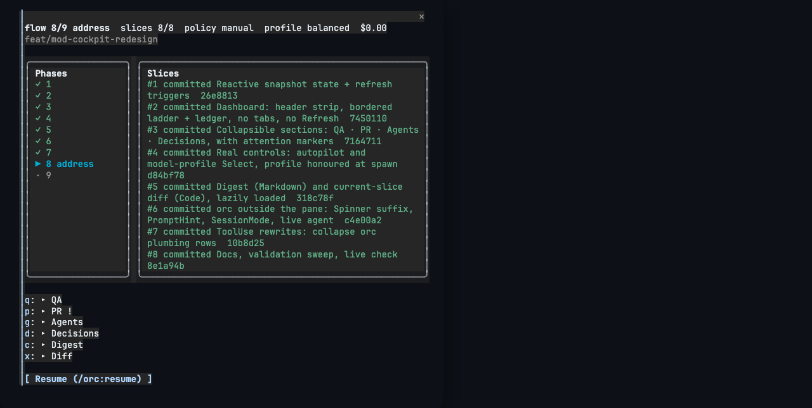
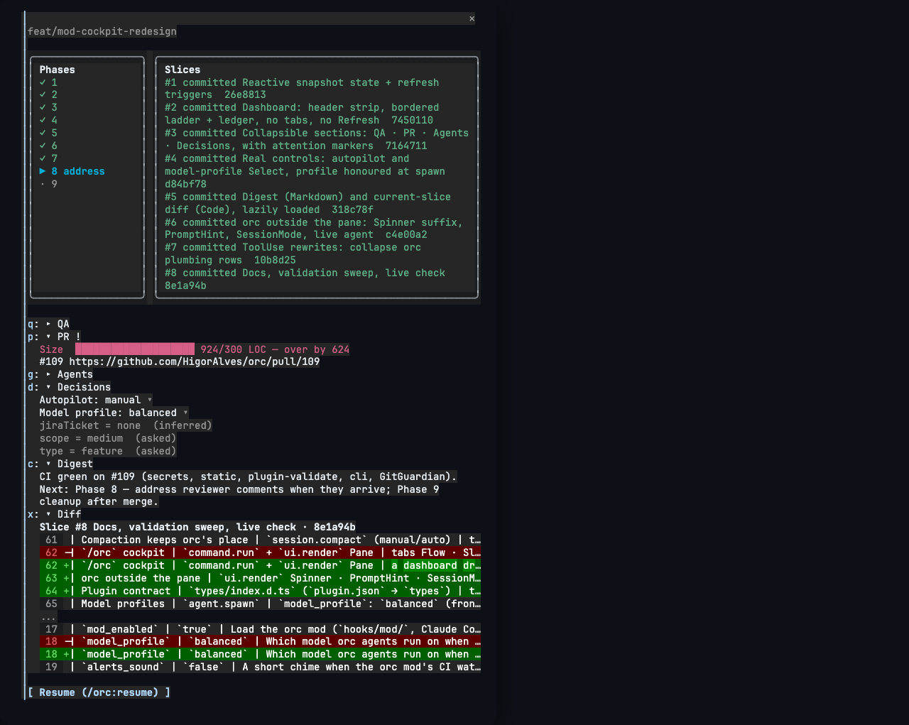

# orc — architecture

## Goal

`orc` is a personal Claude Code plugin built around one loop: **plan → debug → verify → ship**. Every component (skills, commands, agents, hooks) exists to keep the user moving along that loop without dropping discipline (TDD, root-cause debugging, evidence-before-claims).

## Components

```
orc/                               # the plugin
├── .claude-plugin/plugin.json     # manifest — what Claude Code reads to discover the plugin
├── skills/                        # 81 skills, namespaced /orc:<name>
├── commands/                      # 30 composite slash commands /orc:<cmd> (incl. /orc:flow umbrella)
├── agents/                        # 14 specialist subagents (orc-<role>)
├── hooks/                         # SessionStart + PreToolUse(Bash) + PostToolUse + PreCompact + WorktreeCreate/Remove
│   └── mod/                       # the orc mod (register.ts + tests) — in-process hooks, Claude Code 2.1.287+
├── bin/                           # deterministic CLIs, on PATH while enabled (orc-state, orc-report, orc-statusline, …)
├── lib/                           # shared bash libraries behind bin/ + hooks (state.sh, statusline.sh, workspace-detect.sh, …)
└── settings.json                  # plugin-shipped defaults (statusLine; user-level settings always win)
cli/                               # the orc installer CLI (Go / Bubble Tea)
docs/                              # this directory (incl. examples/ — scenario walk-throughs)
.orc/                              # gitignored, ephemeral workspace state (per-session, per-repo)
```

## Why the four-component split

| Layer | Role | Example |
|-------|------|---------|
| **Skills** | Reusable knowledge units the model can invoke on demand. | `orc:tdd` is invoked any time the user starts new code. |
| **Commands** | Thin orchestrators with a known shape. Each composes 2+ skills and (often) writes to `.orc/`. | `/orc:debug` invokes `systematic-debugging` → `tdd` → `error-handling-patterns`. |
| **Agents** | Long-running specialists with isolated context. Used when work needs a fresh window. | `orc-debug-investigator` is dispatched by `/orc:debug` to find root cause without polluting the main session. |
| **Hooks** | Run automatically (no user invocation). Establish discipline at session start; intercept dangerous operations. | `pre-commit-branch-check` downgrades commits to `main` to a confirm prompt. |

## SessionStart hooks (two scripts, two matchers)

`hooks/hooks.json` wires two scripts:

1. **`session-start-using-orc.sh`** (matcher `startup|resume|clear|compact`) — reads `skills/using-orc/SKILL.md` and emits it as additional session context. The model sees orc's iron rules, skill routing, and the callout-palette pointer (`orc:callouts` — GitHub-flavored `[!IMPORTANT]`/`[!WARNING]`/`[!CAUTION]`/`[!NOTE]`/`[!TIP]` blocks with emoji headers) before its first response. The payload is **source-aware**: `startup`/`clear` inject the full skill, `resume` a 3-line reminder (the pre-summary context already carries the rules), `compact` the iron-rules digest only. It also persists workspace detection + the resolved `interaction_policy` into `CLAUDE_ENV_FILE`, and sets the session title from the live orc session via the shared `orc-state line` selector.

2. **`session-start-tool-check.sh`** (matcher `startup` only — binaries don't vanish mid-session) — pre-flight check for orc's CLI dependencies (`git`, `jq` required; `gh`, `agent-browser`, `acli`, `docker`, `graphify`, `osv-scanner`, `gitleaks`, `sentry-cli` recommended). Silent when everything's present; otherwise delivers a `[!WARNING]`/`[!CAUTION]` callout directly to the user via `systemMessage` and a short do-not-reprint note to the model. Suppress with `ORC_SKIP_TOOL_CHECK=1`. Adding new tooling checks later is additive — drop another script alongside.

## PreToolUse(Bash) hooks

`hooks/hooks.json` wires every git/gh pattern to a single dispatcher, **`pre-git-guard.sh`**, which pipes the command through all three checks below and merges their verdicts into at most one permission prompt (deny > ask; reasons joined with `ALSO:`) — a `git push --force` on a protected branch trips two checks but asks once. The `"if"` permission-rule filters narrow which commands spawn the dispatcher, but that filter is best-effort — it **fails open** on unparseable commands — so every check re-matches the command in-script; the regexes and the dispatcher merge are smoke-tested in CI (`scripts/ci/verify-guard-hooks.sh`):

- **`pre-commit-branch-check.sh`** (`git commit`/`git push`) — on protected branches (`main`/`master`/`develop`) it emits `permissionDecision: "ask"`, downgrading the commit/push to a one-keystroke confirm prompt with the reason attached. No env-var escape; the confirm *is* the override.
- **`pre-commit-no-ai-attribution.sh`** (`git commit`/`gh pr`/`gh issue`) — denies (JSON `permissionDecision: "deny"`) any commit/PR/issue body carrying AI-attribution markers. Override only with `ORC_ALLOW_AI_ATTRIBUTION=1`.
- **`pre-destructive-git-check.sh`** (`git reset`/`clean`/`branch`/`push`) — downgrades `reset --hard`, `clean -f*`, `branch -D`, and `push --force`/`-f` to the same confirm prompt on any branch; `--force-with-lease` passes untouched (stack-pr republishing depends on it). Override: `ORC_ALLOW_DESTRUCTIVE_GIT=1`.

## Gates + interaction policy (autopilot)

Multi-phase commands pause at gates, and gates are classified: **hard-outward** (tracker writes, PR review posting, evidence publish — always ask, at every autopilot level), **soft-inward** (plan approval, previews, mechanical confirms), and escalation-only stops. The `interaction_policy` userConfig — or `--auto[=guided|full]` per invocation — sets how soft-inward gates behave: `manual` asks at every gate, `guided` auto-advances mechanical confirms, `auto` runs phases autonomously against a sprint contract agreed at kickoff. Settled answers persist in `.orc/<branch>/files/decisions.json` (`orc-state decision set`, write-once per key with provenance `flag|asked|policy|inferred`), so a question answered once is never re-asked in the same session.

## The orc mod (Claude Code 2.1.287+)

`hooks/hooks.json` also names a hooks module, `hooks/mod/register.ts` — a [Claude Code mod](https://code.claude.com/docs/en/plugins/mods/overview): in-process event handlers that can rewrite events and draw UI. It is a layer on top of the bash hooks, never a replacement: every guardrail stays in the bash settings hooks, so with mods unavailable (older Claude Code, `--safe-mode`, `disableAllHooks`, an org policy) or `mod_enabled: false`, orc behaves identically. What it adds:

| Feature | Event / API | Notes |
|---|---|---|
| Attribution at the source | `attribution.text` (commit/pr) | the model never drafts the trailer the bash guard would deny |
| Compaction keeps orc's place | `session.compact` (manual/auto) | the live `orc-state line` goes to the summarizer; the PreCompact bash hook checkpoints the same facts |
| `/orc` cockpit | `command.run` + `ui.render` Pane | a dashboard drawn from `$.state` (no model turn): header strip (phase, slices, policy, model profile, context %, cost), bordered phase ladder beside the slice ledger (stacked under 72 columns), collapsible QA · PR · Agents · Decisions · Digest · Diff sections (`!` marks attention), `Select`s for autopilot and model profile (settled through `orc-state decision set`), `Link`s to PRs, the resume digest as `Markdown`, the current slice's diff as `Code`. Redraws itself when the model runs an `orc-state` write or a main-loop turn ends. Text summary where nothing draws (`claude -p`, VS Code). |
| orc outside the pane | `ui.render` Spinner · PromptHint · SessionMode · ToolUse | the spinner suffix carries `orc flow 5/9 implement · implementer`, the idle prompt hint names the flow, a non-manual policy shows in the mode footer, and orc's own CLI rows (`orc-state`, `orc-pr-size`, `orc-report`, `gh pr checks`) collapse to one dim line |
| Plugin contract | `types/index.d.ts` (`plugin.json` → `types`) | the `PluginState.orc` keys the mod keeps in `$.state`: `snapshot`, `sections`, `live`, `details`. The engine follows `$` only inside `register.ts`, so every hook and loader lives there; `cockpit.ts`, `pane.ts` and `state.ts` are pure |
| Model profiles | `agent.spawn` | `model_profile`: `balanced` (frontmatter), `quality` (investigator on `best` — Fable, else Opus; reviewers on Opus), `economy` (Opus-tier agents on Sonnet); an explicit per-dispatch model always wins |
| Usage ledger | `agent.spawn` + `turn.complete` | every finished orc subagent run → `orc-state usage add` → `files/usage.jsonl`; the cockpit's Agents section and model re-tuning read it |
| Gate badges | `ui.render` AskUserQuestion | outward (`Publish`/`Post`/`Tracker`) and `Escalation` header chips (`orc:gates`) get a badge above the engine's own dialog |
| CI watcher | `$.clock.every` + `$.store` lease | interactive sessions poll linked PRs' checks (one poller per PR across sessions); red/green → status line, toast, optional chime (`alerts_sound`), a dim `/orc:ci <n>` suggestion, and a red-CI band above the prompt with Diagnose / Dismiss. It never pushes, posts, or starts a turn. |

The `/orc` cockpit, docked beside the transcript (Claude Code 2.1.291, 132 columns):





`/orc:status` remains the full markdown report. Tests: `claude plugin test orc` (`hooks/mod/tests/*.test.ts`, headless). `claude plugin validate ./orc` lists the events it hooks and every API call it makes.

**Model routing.** Agent frontmatter is the `balanced` default and stays put until the usage ledger and the eval suite justify a change; the `quality`/`economy` profiles carry the current hypotheses (investigator → Fable, code-fixer Haiku → Sonnet, …) so they can be measured per repo before they become defaults.

## Statusline

`orc/settings.json` ships a default `statusLine` → `bin/orc-statusline` (renderer in `lib/statusline.sh`; user-level settings win). One jq pass over the payload + the shared `orc-state line` selector + a session-keyed 5s git cache; fixtures in `scripts/ci/verify-statusline.sh`. The renderer writes a per-session bridge file that `hooks/scripts/post-context-monitor.sh` (PostToolUse) reads to give the agent advisory low-context warnings — one tier scale, computed once in `lib/statusline.sh`.

## `.orc/` workspace state

Multi-phase commands (`/orc:plan`, `/orc:start`, `/orc:debug`, `/orc:fan-out`, web-mode `/orc:qa`) checkpoint after every phase. **The normative schema lives in the `orc:state-protocol` skill, and `bin/orc-state` is the single writer** — registry entries and checkpoint frontmatter are written by the same verb, so they cannot drift. State lives in `.orc/<sanitized-branch>/files/`:

```
.orc/
├── orc.json                                 # central registry of active sessions
├── .worktrees/                              # pinned git worktrees (never $HOME) — <repo>/<branch>
└── feat-142-notification-prefs/
    └── files/
        ├── checkpoint.md                    # frontmatter mirror + resume digest — the resume entry point (≤4 KB)
        ├── slices.json                      # slice ledger (status machine; written via orc-state)
        ├── usage.jsonl                      # per-subagent-run tokens/time (orc mod → orc-state usage add)
        ├── plan.md                          # if /orc:plan ran
        ├── diagnosis.md                     # if /orc:debug ran
        ├── progress.md                      # append-only history (never read by resume by default)
        ├── qa/                              # if web-mode /orc:qa ran
        │   ├── screenshot-NN-step.png
        │   ├── snapshot-final.txt
        │   ├── network.har
        │   ├── steps.md
        │   ├── qa-manifest.json             # machine-readable packet (criteria, curated payload)
        │   ├── report.html                  # orc-report html — self-contained, publishable as a private Artifact
        │   └── console.log
        └── fan-out/                         # if /orc:fan-out ran
            ├── task-NN-slug/result.md
            └── summary.md
```

`.orc/` is gitignored. State is **personal** and **ephemeral** — its purpose is pause/resume across sessions, not artifacts for a team.

### Lifecycle

1. **Init** — `orc-state init` creates the directory, the registry entry, and the checkpoint skeleton in one call.
2. **Update** — every phase writes its artifact, then `orc-state phase set <n>` + `orc-state digest write -` (registry + checkpoint mirror bumped together).
3. **Resume** — `/orc:resume` runs the startup sequence from `orc:state-protocol`: session entry → bounded checkpoint → git cross-check → the one artifact the digest's `Next:` names.
4. **Status** — `/orc:status` reads `orc.json` (read-only); never modifies.
5. **Cleanup** — done sessions stay until manually `rm -rf .orc/<branch>/`.

### Optional `jiraTicket` field

Every session entry in `.orc/orc.json` and every `checkpoint.md` frontmatter accepts an optional `jiraTicket: <KEY>` field linking the work to a Jira issue.

- **Written by** `/orc:plan` (Phase 1 prompt or `--jira <KEY>` flag), `/orc:debug` (Phase 1 prompt or `--jira` flag), `/orc:flow` (Phase 1 triage prompt or `--jira` flag), and `/orc:start` (forwards `--jira` to `/orc:plan`). Also written explicitly by `/orc:jira bind <KEY>` and cleared by `/orc:jira unbind`.
- **Read by** `/orc:status` (per-row `[<KEY>]` indicator), `/orc:ship` (appends `Resolves <KEY>` trailer to PR body — keyword overridable via `$ORC_JIRA_PR_KEYWORD`), and `/orc:resume` (echoes the bound key in the resume summary).
- **Validated as** `^[A-Z][A-Z0-9_]*-\d+$` before any file write — typo'd keys are refused at the prompt.

The field is purely additive: pre-existing `.orc/` state without `jiraTicket` continues to work unchanged. `/orc:jira bind`/`unbind` refuse to run when no in-progress session exists for the current branch.

## Code discovery (optional token optimization)

Discovery — finding and understanding the code relevant to a task — is the largest easily-wasted token cost in a session. When [Graphify](https://github.com/Graphify-Labs/graphify) is installed, orc prefers a pre-built code graph over raw Glob/Grep/Read: the `orc:code-discovery` skill defines the protocol (detect → build a code-only graph with `graphify extract . --code-only` → answer with `graphify query`/`explain`/`path` → read only the cited `source_location`s), and it is preloaded into the discovery-heavy agents (`orc-implementer`, `orc-debug-investigator`, `orc-refactor-architect`, `orc-prd-analyzer`), referenced from `writing-plans` and `improve-codebase-architecture`, and primed once per worktree in `/orc:start` (Phase 1b). Graphify is a **recommended** tool (see the tool-check above) and the whole path is guarded — when it's absent, unhealthy, or the graph is empty, discovery degrades cleanly to Glob/Grep/Read. Code extraction is local tree-sitter AST and needs no API key. A project-scoped stdio `graphify` MCP server (`orc mcp add graphify`) exposes the same graph as `query_graph`/`get_node`/`shortest_path` tools — this needs graphify installed with the `mcp` extra (`graphifyy[mcp]`, which the tool-check install recipe pulls in); plain `graphifyy` still serves discovery.

## Web QA evidence (a hard rule)

Any change touching a web surface goes through `/orc:qa --web` (or auto-detected). The `orc-qa-validator` agent drives a real browser via the [vercel-labs/agent-browser](https://github.com/vercel-labs/agent-browser) CLI (loaded via the `orc:agent-browser` skill), capturing **required** artifacts:
- per-step `screenshot-NN-<step>.png` (use `--annotate` to overlay element refs `@eN`)
- `ac-<sliceId>-<idx>-<slug>.png` — one shot per acceptance criterion, captured at the moment it becomes observable
- `qa-<branch>.webm` — the recorded walk (from `agent-browser record start/stop`), required whenever the change touches a rendered surface. agent-browser's recorder wraps `ffmpeg` (a **recommended** tool in the tool-check above), so a host without it degrades to stills plus a stated reason in `steps.md` — the run is never blocked and the gap is never silent
- `qa-manifest.json` — the machine-readable packet spine: artifacts, curated publish payload, and one scored `acceptance` row per criterion
- `snapshot-final.txt` — accessibility tree at end of run (from `agent-browser snapshot`)
- `console.log` — browser console output (from `agent-browser console`)
- `network.har` — network traffic (from `agent-browser network har start/stop`)
- `steps.md` — narrated golden-path + edge cases

The acceptance criteria are the rubric, not the decoration: both drivers load them from `slices.json` before touching the browser, and both score every one into `qa-manifest.json`, which is what `/orc:qa` Phase 5 reads to build `qa-verdict.json`. The Claude-in-Chrome driver produces a `qa-<branch>.gif` instead of on-disk screenshots (the session cannot write binary), so its criterion evidence anchors to numbered steps in `steps.md`.

Optional bonus artifacts (NOT required): `trace.json` (Chrome DevTools), `react-renders.json`, `vitals.json`.

No "QA passed" claim is accepted without the required artifacts in `.orc/<branch>/files/qa/`. `orc:verification-before-completion` enforces this.

## Stack scope

Curated skills cover four optional packs (all enabled): `web-react` (incl. vitest), `backend` (Node/NestJS/Postgres/Stripe), `ios` (SwiftUI), `workflow-extras` (Docker/Turborepo/Sentry/skill-authoring/PRD-issue tooling/agent-browser).

Plus the doc-authoring family for senior/architect practice: `adr-writing` (Architecture Decision Records), `rfc-writing` (system-design RFCs), `postmortem-writing` (blameless incident postmortems), `prd-writing` (Product Requirements Documents), `trd-writing` (Technical Requirements Documents). Fifteen further skills are vendored or merged from MIT-licensed community sources (mattpocock/skills at pin `2ffb184`, obra/superpowers, antfu/skills, twostraws/SwiftUI-Agent-Skill) with provenance frontmatter per skill and full notices in `THIRD-PARTY-LICENSES.md`.

## Relationship to compozy

orc borrows compozy's session-state idea, hook layout, and YAML-frontmatter conventions. It diverges in two places:
1. Workspace state is **hidden + gitignored** (`.orc/`) instead of committed (`compozy/`). orc is a personal plugin; nothing needs sharing.
2. Command surface covers the full SDLC (30 commands, all composing the same plan → debug → verify → ship spine, now extended past PR-open with ci/release/deps/incident), with explicit web-QA evidence as a first-class concern — including the environment it runs against: `/orc:qa` and `/orc:flow` provision a Docker dev environment via `orc-env-provisioner` before browser QA (`orc:env-provisioning` skill; `/orc:env` standalone).

## See also

- `docs/contributing.md` — how to add a new skill, command, or agent
- `docs/commands.md` — the full command / agent / skill catalog
- `docs/examples/` — scenario walk-throughs
- `README.md` — the landing page
- `skills/using-orc/SKILL.md` — iron rules (also injected at SessionStart)
