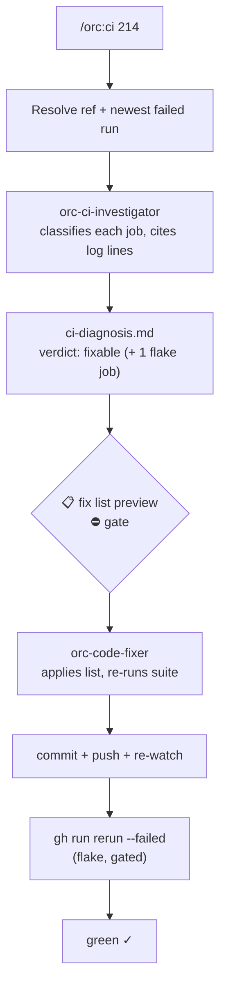

# 13 — Fixing red CI

## Scenario

You pushed `feat/order-export`, opened PR #214, and the checks went red: `unit (ubuntu-latest)` failed and `e2e (chromium)` failed. The combined logs are ~4,000 lines. You could hand-read them, or you could let `/orc:ci` dispatch an investigator that reads logs — not tea leaves — and comes back with an evidence-cited diagnosis and a fix list.

The catch on this branch: only one of the two failures is your fault.

## Flow



## Walk-through

### Phase 1 — Resolve the ref + run

```
/orc:ci 214
```

The explicit PR number wins the resolution order (no `--run` pin given). `gh pr checks 214` shows two failed checks; the newest failed run for the head SHA is `16482093011` — pinned. State is registered via the `orc-state init --command ci` one-liner: `.orc/feat-order-export/files/` created, an entry in `.orc/orc.json` (`command: "ci"`, `status: in_progress`), and `checkpoint.md` records the resolved ref + run ID.

Had everything been green, `/orc:ci` would say so and stop — green is a valid answer, and the command never manufactures work.

### Phase 2 — Dispatch the investigator

**`orc-ci-investigator`** is dispatched via `Task` with the ref, the head SHA, and a `git log -5 --oneline` summary for drift correlation. The agent never edits code and never re-runs workflows — it pulls `gh run view 16482093011 --log-failed`, classifies every failed job with a cited log line, and checks run history before it dares claim flake. The report is saved verbatim to `.orc/feat-order-export/files/ci-diagnosis.md`:

```
## CI diagnosis — PR #214 (run 16482093011)

Verdict: fixable

| Job | Step | Class | Evidence (log line) |
|-----|------|-------|---------------------|
| unit (ubuntu-latest) | npm test | test  | "Expected substring: 'Invalid order status' — validate.test.ts:57" |
| e2e (chromium)       | npx playwright test | flake | "Timeout 30000ms exceeded waiting for locator('[data-testid=export-toast]')" |

### Fix list
1. src/orders/__tests__/validate.test.ts:57 — assert the new message
   "Order status must be one of: pending, paid, shipped" (renamed in
   4c9e1f2 on this branch) — clears unit (ubuntu-latest)

### Flake evidence — e2e (chromium)
- Same job green on the same SHA in run 16480771254
- Failed 2 of the last 10 ci.yml runs on main; passed on every retry
- This diff touches no e2e spec (git diff against main)
```

One root cause, not two: the unit failure is the branch's own doing (a test asserting the old error message), the e2e failure is intermittency with run-history proof.

### Phase 3 — Route on the verdict: `fixable`

Routing follows `orc:ci-routing`. The diagnosis was saved via `Write` — the single-render rule — so this preview is its ONE capped rendering:

> **📋 Preview — CI fix list**
>
> 1 root cause across 1 failed job. Applying clears `unit (ubuntu-latest)`; `e2e (chromium)` is classified flake and handled separately.

```
1. src/orders/__tests__/validate.test.ts:57 — update the asserted error
   message — clears unit (ubuntu-latest)
```

> **⛔ Gate — apply CI fixes**
>
> ONE `AskUserQuestion` call, two questions: apply the fix list? — and, collected up front, how to land a green fixer report.

You answer **"Apply the fix list"** and **"Commit + push + re-watch"**. **`orc-code-fixer`** receives the fix list + the diagnosis path — never "CI is red, go fix it" — applies the one-line edit, runs `npm test` locally (212 passed), and reports the diff + test summary.

The pre-collected landing answer executes without a second stop: `orc:git-commit` composes `test(orders): assert renamed order-status validation message`, pushes, and `/orc:ci` loops back to Phase 1 with `--watch` semantics: `gh run watch 16482210447` until the new run concludes.

### Phase 4 — The flake strikes again

New run `16482210447`: `unit (ubuntu-latest)` green, `e2e (chromium)` red — the same timeout line. `/orc:ci` re-prints the flake evidence from the diagnosis (run-history lines proving intermittency), then gates the re-run. You pick **"Re-run failed jobs"**:

```
gh run rerun 16482210447 --failed
gh run watch 16482210447
```

The e2e job passes on the retry. Run green.

### Phase 5 — Checkpoint

`checkpoint.md` is updated: phase=done, verdict `fixable`, run `16482210447`, fix commit SHA, final conclusion `success`. The `.orc/orc.json` entry flips to `completed`, and the final status is one line: verdict, run ID, what cleared.

## Artifacts

```
.orc/feat-order-export/files/
├── checkpoint.md          # phase: done, verdict: fixable, run: 16482210447
└── ci-diagnosis.md        # investigator report, saved verbatim
```

Plus the fix commit on the branch (`test(orders): assert renamed order-status validation message`).

## Done when

- The newest run on the PR is green, run ID cited.
- The fix landed via the gated fix list — the fixer only ever saw an evidence-cited diagnosis.
- The flake re-run happened only after the evidence was shown and you confirmed.
- The session in `.orc/orc.json` reads `completed` (resumable mid-way via `/orc:resume` if interrupted).

## Variants

- **`/orc:ci --watch` right after a push** — polls `gh run watch` until the run concludes. Green → report and exit; red → the normal flow starts with that run pinned.
- **`--run 16482093011`** — pin an explicit run ID instead of resolving the newest one (useful when a newer run superseded the interesting failure).
- **Verdict `infra`** — runner provisioning died, action version yanked, registry outage. No code changes offered; the diagnosis + recommendation surfaces (pin the action version, wait it out), re-run only if the agent recommended one.
- **Verdict `needs-debug`** — the test failure is a genuine regression beyond the diff. `/orc:ci` hands off: `/orc:debug` starts pre-seeded with `ci-diagnosis.md` as the bug description instead of starting from zero.
- **Red fixer report** — if the fixer's local suite stays red, the loop returns to Phase 2 with the new evidence; the investigator sees the failed attempt.
- **Workspace mode, 2+ linked PRs** — no silent broadcast: `/orc:ci` asks which PR(s) to investigate, then dispatches one investigator per targeted PR in parallel.
- **`--auto=full`** — the `fixable` route applies the fix list and lands it (commit + push + re-watch) after printing the capped preview; a red fixer report or a `flake`/`infra`/`needs-debug` verdict still stops.

## Iron rules in play

- **No fix without the investigator's diagnosis.** The fixer only ever receives an evidence-cited fix list.
- **Every classification cites a log line.** "Timeout" alone is not proof of flake — run history is.
- **Re-runs are gated.** `gh run rerun` only after the flake evidence is shown and you confirm.
- **Green is a valid answer.** Newest run passes → report and stop.
- **Never `git push --force`.** A red pipeline is not a license for history rewrites.
