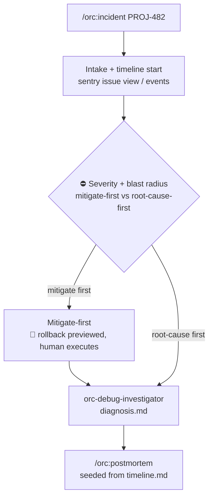

# 14 — Running a live incident

## Scenario

15:19 UTC: the pager fires. Checkout is returning 500s, Sentry issue **PROJ-482** is spiking, and the graph kinks upward right at the 14:00 deploy. Customers are failing to pay *right now*.

Example 02 is the morning after — `/orc:postmortem` studies a fire that's out. `/orc:incident` runs one that's still burning: stop the bleeding before you study the wound, and keep a timeline the postmortem will inherit.

```
/orc:incident PROJ-482
```

## Flow



## Walk-through

### Phase 1 — Intake + timeline start

The argument matches a Sentry short ID, so the `orc:sentry-cli` skill pulls it live — no pre-auth, no org lookup, the CLI auto-detects both:

```bash
sentry issue view PROJ-482 --json
sentry issue events PROJ-482 --json -n 5
```

Captured to `.orc/main/files/incident/evidence.md`: title `TypeError: Cannot read properties of undefined (reading 'currency')`, culprit `POST /api/checkout/session`, level `error`, `count: 1204`, `userCount: 312`, `firstSeen: 2026-08-05T14:07:12Z`, `lastSeen` seconds ago, latest event tagged `release: 2026.08.05-1400`, `environment: production`.

Simultaneously the session is registered in `.orc/orc.json` and `timeline.md` starts — append-only, one UTC row per action, **in the same turn it happens**, never batched from memory:

```
| Time (UTC)           | Who | What                                                              |
|----------------------|-----|-------------------------------------------------------------------|
| 2026-08-05T15:21:04Z | orc | Incident session opened; intake: Sentry PROJ-482                  |
| 2026-08-05T15:21:38Z | orc | Pulled PROJ-482: 1,204 events / 312 users since 14:07Z; release 2026.08.05-1400 |
```

(If `sentry` exits 10–19 — auth error — the command says run `sentry auth login` and continues with whatever you can paste manually.)

### Phase 2 — Assess: severity, blast radius, the gate

Blast radius with evidence, not vibes: 312 users, one endpoint (checkout only), rate still climbing (`lastSeen` fresh). `git log --oneline --since="2026-08-05T13:45:00Z"` shows exactly one deploy-window commit — `d9e4c1f feat(checkout): read price from price-book service` — matching the event's `release` tag. Strong deploy correlation.

Severity wasn't passed, so the command proposes a tier:

```
> **⛔ Gate — mitigate first, or root-cause first?**
>
> SEV-2 — 312 users, ongoing since 14:07Z. Recommendation: mitigate-first —
> user impact is ongoing and a rollback path exists (suspect deploy d9e4c1f).
```

`AskUserQuestion`: mitigate first / root-cause first / both in parallel. You pick **mitigate first**.

### Phase 3 — Mitigate-first (the human pulls the trigger)

Options are built from the evidence — rollback names the exact target, not "roll back somehow". Before anything state-changing:

```
> **🛑 Mitigation preview — NOT executed**
>
> Exact commands/steps below. /orc:incident does not run production
> mutations — you (or your deploy tooling) execute; orc records.
```

```
gh workflow run deploy.yml -f release=2026.08.05-0930   # redeploy last-good (8c41f2e)
```

You run it, answer "I ran it — record in timeline", and orc verifies the bleeding actually stopped by re-pulling the issue and comparing `lastSeen`:

```
| 2026-08-05T15:31:02Z | you | Rollback executed: redeployed release 2026.08.05-0930 (8c41f2e) |
| 2026-08-05T15:34:47Z | orc | Verified: sentry issue view PROJ-482 — lastSeen stale since 15:31Z, rate at baseline |
```

Mitigated is not fixed — the command immediately offers the root-cause path. Snoozing the pager is not a resolution.

### Phase 4 — Root cause

`orc-debug-investigator` is dispatched with `evidence.md`, the deploy correlation, and recent commits. It returns a written diagnosis, saved to `.orc/main/files/incident/diagnosis.md`:

```
## Root cause
`src/checkout/session.ts:88` — the new price-book lookup returns 404 for
legacy SKUs (pre-2024 catalog); the handler reads `.currency` off an
undefined body. Introduced in d9e4c1f — the legacy-SKU fallback map was
dropped in the migration.
```

```
> **⛔ Gate — diagnosis**
>
> Legacy SKUs 404 in price-book; handler dereferences undefined. Fix surface: session.ts:88 + fallback map.
```

You pick **"Park it"** — the incident is mitigated; the fix ships tomorrow through `/orc:debug` discipline (regression test first, then `orc-code-fixer`, then `orc:verification-before-completion`).

### Phase 5 — Stabilize + handoff

Stable is declared only with evidence — the fresh Sentry read from Phase 3, recorded in the timeline. Session flips to `completed` in `.orc/orc.json`, and:

```
> **➡️ Next**
>
> Incident stable. Run `/orc:postmortem checkout-price-book-2026-08-05 --severity sev-2` —
> its Phase 4 builds the timeline FIRST, and .orc/main/files/incident/timeline.md IS that
> timeline, already timestamped. evidence.md and diagnosis.md feed its root-cause phase.
```

The postmortem (example 02) starts from real rows instead of memory archaeology.

## Artifacts

```
.orc/main/files/
├── checkpoint.md                  # phase: done
└── incident/
    ├── timeline.md                # append-only UTC rows — the postmortem's spine
    ├── evidence.md                # Sentry JSON, blast radius, deploy correlation
    └── diagnosis.md               # root cause from orc-debug-investigator
```

Plus the session entry in `.orc/orc.json` (severity recorded) — `/orc:resume` can continue a half-run incident from its checkpoint, re-reading `timeline.md` first.

## Done when

- Every pull, finding, mitigation, and verification has a UTC timeline row, appended as it happened.
- The mitigation was previewed (🛑) and executed by a human — orc recorded, never acted.
- "Stable" is backed by a fresh `sentry issue view` (stale `lastSeen`) or an explicit dashboard confirmation, in the timeline.
- The `/orc:postmortem` handoff was offered with the timeline as its seed (declining one for a SEV-1/2 is itself noted in the timeline).

## Variants

- **Pasted stack trace instead of a Sentry ID** — the command identifies the throwing frame and greps the repo to locate the code; no Sentry required.
- **Described symptom only** ("checkout is 500ing since the 14:00 deploy") — it asks for minimum concrete facts, then offers `sentry issue list -q "checkout" --json` to find the issue.
- **`--severity sev-1` passed** — skips the severity proposal; blast radius is still assessed.
- **"Both in parallel"** at the gate — orc dispatches the investigator while you mitigate manually; your steps get timeline rows as you report them.

## Iron rules in play

- **Timeline or it didn't happen.** Rows append in the same turn as the action — never reconstructed at the end.
- **No production mutations, ever.** Rollbacks, flag flips, scaling: previewed with 🛑, executed by the human, recorded by orc.
- **No "stable" claim without evidence.** A fresh Sentry read or an explicit user confirmation — recorded.
- **Mitigation is not resolution.** The root-cause path is always offered before the session closes.
