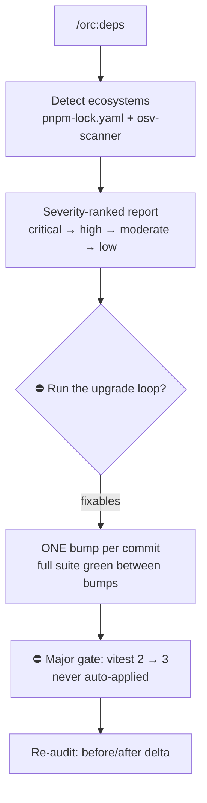

# 15 — Monthly dependency audit

## Scenario

First Monday of the month: dependency hygiene on a pnpm repo. Nothing is on fire — you want to know what's vulnerable, what's behind, and to move safely without turning the lockfile into a 4,000-line mystery diff.

```
/orc:deps
```

No verb means `audit`. Doctrine comes from `orc:dependency-management`; the exact pnpm commands from its `references/npm.md`.

## Flow



## Walk-through

### Phase 1 — Resolve verb + ecosystems

Verb defaults to `audit`. `pnpm-lock.yaml` is present → npm-family ecosystem; `command -v osv-scanner` finds the binary, so it's preferred over `pnpm audit` (reads the lockfile directly, less noisy, covers polyglot repos in one pass).

### Phase 2 — Audit

`git status` first — a dirty lockfile would poison the scan; the tree is clean. Then:

```bash
osv-scanner scan --lockfile pnpm-lock.yaml
```

Findings render severity-ranked — critical → low, never alphabetically — and criticals lead:

```
> **🛑 Critical vulnerabilities**
>
> 1 critical finding: fast-xml-parser@4.2.4 — GHSA-x3f7-rq92-vh8m.
> Fix or mitigate before shipping anything from this branch.
```

```
| Severity | Package                              | Installed | Fixed in | Advisory            | Bump  | Class |
|----------|--------------------------------------|-----------|----------|---------------------|-------|-------|
| critical | fast-xml-parser (via @aws-sdk/client-s3) | 4.2.4 | 4.2.5    | GHSA-x3f7-rq92-vh8m | patch | prod  |
| moderate | undici                               | 6.19.2    | 6.19.8   | GHSA-h87w-3qpv-jm42 | patch | prod  |
| moderate | micromatch                           | 4.0.7     | 4.0.8    | GHSA-952p-6rrq-rcjv | patch | dev   |
| moderate | vitest                               | 2.0.5     | 3.0.2    | GHSA-8v4j-pq6f-2mc3 | major | dev   |
```

Three findings are **fixable** in-range; vitest is **fixable via major** — a different animal, escalated individually, never batched. `AskUserQuestion`: "Run the upgrade loop for the 3 fixable vuln(s)" / "Only the criticals/highs" / "Report only". You pick the loop.

### Phase 4 — The upgrade loop

The session registers in `.orc/orc.json` (`command: "deps"`), a checkpoint lists the queue, and the gate previews it:

```
> **📋 Bump queue**
>
> 1. fast-xml-parser 4.2.4 → 4.2.5 (patch)  2. undici 6.19.2 → 6.19.8 (patch)
> 3. micromatch 4.0.7 → 4.0.8 (patch). One commit each; full suite runs
> between bumps; a red suite reverts the bump.
```

Then, strictly one at a time — lockfile-only when the manifest range allows:

```bash
pnpm update fast-xml-parser        # transitive; moves within range, lockfile-only diff
pnpm test                          # 412 passed (412)
git add pnpm-lock.yaml && git commit -m "chore(deps): bump fast-xml-parser from 4.2.4 to 4.2.5"
```

Same for undici, same for micromatch — three green suites, three commits. The checkpoint updates after each bump, so `/orc:resume` could pick up mid-queue. Had any suite gone red, that bump would be **reverted** (`git restore` manifest + lockfile), recorded in `deps-report.md`, and the queue would continue — never forced, never patched around in the same commit.

Then vitest hits the major gate:

```
> **⛔ Gate — major bump: vitest 2.0.5 → 3.0.2**
>
> This is a migration, not a bump. Changelog/migration guide:
> https://vitest.dev/guide/migration — Apply now, defer, or skip?
```

You **defer** — the migration touches `vitest.config.ts` and a handful of mock APIs, so it gets its own branch next sprint. It is never auto-applied, and `--all-safe` would not have touched it either: majors are excluded from "safe" by definition.

### Phase 5 — Re-audit + checkpoint

The loop started from vulns, so it ends with evidence, not assertion:

```bash
osv-scanner scan --lockfile pnpm-lock.yaml
# before: 1 critical, 3 moderate → after: 0 critical, 1 moderate (vitest, deferred)
```

The delta plus the deferral (with the migration link) lands in `deps-report.md`; the session flips to `done`.

## Artifacts

```
.orc/chore-deps-august/files/
├── checkpoint.md        # queue position → done
└── deps-report.md       # bumps applied (3), reverted (0), majors deferred (1, with link)
```

Plus three commits, each implicating exactly one package:

```
a1c9f04 chore(deps): bump micromatch from 4.0.7 to 4.0.8
7e22b8d chore(deps): bump undici from 6.19.2 to 6.19.8
3f81d2a chore(deps): bump fast-xml-parser from 4.2.4 to 4.2.5
```

## Done when

- The re-audit output shows the delta — no "audit clean" claim without it.
- Every applied bump is its own commit with a green suite behind it.
- Every major is either applied with explicit approval or deferred with its migration link recorded.
- `deps-report.md` accounts for the whole queue: applied, reverted, deferred.

## Variants

- **`/orc:deps outdated`** — read-only survey: package / current / wanted / latest / bump-class table, safe batch (patch + minor) recommended, majors in their own section. Ends with `➡️ Next steps` pointing at `upgrade --all-safe`.
- **`/orc:deps upgrade --all-safe`** — skips the vuln framing; builds the queue from a fresh outdated survey (patch + minor, in-range) and runs the same one-bump-per-commit loop. Majors still gate per package.
- **osv-scanner not installed** — `command -v osv-scanner` comes back empty; falls back to `pnpm audit` (or `npm audit` on npm repos) per `references/npm.md`. Caveat from the reference: native audit flags dev-only and unreachable paths at full severity — cross-check with `--omit=dev` before ranking. And never `npm audit fix --force`: it applies majors silently, the exact thing the doctrine forbids.
- **No fix yet** — reported with suggested mitigations (`pnpm.overrides` to pin the transitive), applied only with user sign-off and a tracking issue — overrides silently outlive the upstream fix.

## Iron rules in play

- **`audit` and `outdated` are read-only.** No lockfile mutations, no commits, until you choose the loop.
- **ONE bump per commit; suite green between bumps.** A red bump is reverted, never forced.
- **Majors are NEVER auto-applied** — per-package gate with the migration link, even under `--all-safe`.
- **No "clean" claim without command output.** The re-audit delta is the evidence, per `orc:verification-before-completion`.
