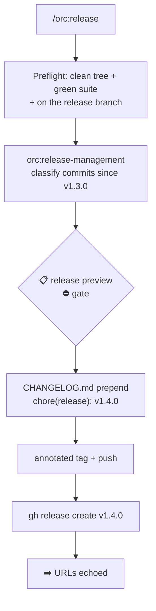

# 16 — Cutting a release

## Scenario

Your project `acme/relay` — a webhook delivery service — just merged its retry/dead-letter train. Since `v1.3.0` the default branch has accumulated 9 conventional commits: 6 `feat`, 2 `fix`, 1 `chore`. You want the next version tagged and published with notes a reviewer can audit, not a hand-typed tag and a "various improvements" release page.

A release here is a mechanical consequence of the commit history, not a judgment call: the commits determine the bump, the same commits grouped become the changelog, an annotated tag plus `gh release create` publishes it.

> **🛑 Not for orc itself**
>
> `/orc:release` refuses to run in orc's own repo — orc uses a dual-tag process (`orc--v*` plugin tags, plain `v*` CLI tags) documented in `docs/contributing.md`. A generic single tag there would misfire the goreleaser workflow or ship a plugin nobody can install.

## Flow



## Walk-through

### Phase 1 — Preflight: clean tree + green suite

```
/orc:release
```

Hard rule first, no override flag exists:

1. `git status --porcelain` — empty. (Untracked files count as dirty.)
2. The project's own test command is detected from `package.json` and run: `npm test` → `Test Files 38 passed (38) · Tests 347 passed (347)`. Per `orc:verification-before-completion`, no green claim without reading the output.
3. Current branch is `main` — the release branch. (A feature branch here would be surfaced and confirmed; it's almost always a mistake.)

Had either check failed, the command stops cold:

> **🛑 Cannot release**
>
> dirty tree: 2 modified files. Fix, commit, and re-run — there is no override.

Preflight passed, so a session is registered in `.orc/orc.json` (`command: "release"`) and `.orc/main/files/checkpoint.md` starts tracking phases for `/orc:resume`.

### Phase 2 — Compute the bump

The command announces: *"I'm using the release-management skill because this task cuts or prepares a release."* Then, following the doctrine:

1. `git describe --tags --abbrev=0` → `v1.3.0` (sanity-checked against `git tag --list --sort=-v:refname`).
2. `git log v1.3.0..HEAD --no-merges` → 9 commits, each classified: 6 `feat` → minor, 2 `fix` → patch, 1 `chore` → none. **Highest wins: minor.** `v1.3.0` → `v1.4.0`.
3. PR links resolved — squash-merge repo, so subjects already carry `(#N)`; verified rather than re-searched.

The classified list is saved to `.orc/main/files/release-evidence.md`.

### Phase 3 — Preview + gate

The grouped commit list is what makes the bump auditable:

> **📋 Release preview**
>
> `v1.3.0` → `v1.4.0` (**minor**) — 9 commits since v1.3.0.

```
Features:
  8f3c2a1 feat(delivery): retry with exponential backoff (#141)
  2b9d4e7 feat(delivery): dead-letter queue for exhausted retries (#143)
  c71a0f2 feat(api): per-endpoint signing secrets (#144)
  9e40b3c feat(dashboard): delivery attempt timeline (#146)
  5d18c9a feat(api): idempotency keys on replay (#148)
  e02f7b4 feat(cli): relay tail command for live delivery logs (#150)
Fixes:
  41c6d2e fix(delivery): duplicate delivery on requeue race (#147)
  7a95e10 fix(dashboard): timezone off-by-one in attempt timestamps (#151)
Other (no bump):
  b3e81f6 chore(deps): bump undici to 6.19 (#149)
```

> **⛔ Gate — release**

`AskUserQuestion`: **"Release v1.4.0 — proceed"** / "Override the bump — pick major / minor / patch myself" / "Abort". You proceed. The computed bump is never applied silently.

### Phase 4 — Changelog

`relay` keeps a `CHANGELOG.md`, so the new section is prepended in the file's existing style — entries written as user-facing outcomes, not commit subjects verbatim:

```markdown
## v1.4.0 — 2026-08-05

### Features
- Exponential-backoff retries with a dead-letter queue for exhausted deliveries (#141, #143)
- Per-endpoint signing secrets (#144)
- Idempotency keys on replay (#148)
- Delivery attempt timeline in the dashboard (#146)
- `relay tail` — live delivery logs from the CLI (#150)

### Fixes
- Duplicate delivery on requeue race (#147)
- Timezone off-by-one in attempt timestamps (#151)
```

Committed as `chore(release): v1.4.0` (per `orc:git-commit`). The same notes are written to `.orc/main/files/release-notes.md` for Phase 5. Had the repo had **no** changelog file, orc would not create one silently — that's an explicit-consent question.

### Phase 5 — Tag + publish

Annotated tag only — lightweight tags carry no message, no tagger, no date:

```
git tag -a "v1.4.0" -m "v1.4.0"
git push origin "v1.4.0"
gh release create "v1.4.0" --title "v1.4.0" \
  --notes-file .orc/main/files/release-notes.md
```

> **➡️ Released**
>
> Tag: `v1.4.0` · Release: https://github.com/acme/relay/releases/tag/v1.4.0 · Compare: acme/relay/compare/v1.3.0...v1.4.0

The checkpoint flips to `status: done` with the version and URLs.

## Artifacts

```
.orc/main/files/
├── checkpoint.md              # phase: done, version: v1.4.0, URLs
├── release-evidence.md        # the classified 9-commit list
└── release-notes.md           # exactly what gh release published

CHANGELOG.md                   # v1.4.0 section prepended, committed
```

Plus, on the remote: annotated tag `v1.4.0` and the GitHub release.

## Done when

- The annotated tag `v1.4.0` is pushed and the release URL echoed.
- The published notes match `release-evidence.md` — every entry traceable to a commit and PR.
- `CHANGELOG.md` carries the same section, committed as `chore(release): v1.4.0`.
- The session in `.orc/orc.json` reads done.

## Variants

- **`/orc:release --dry-run`** — stops after the Phase 3 preview: bump computed, evidence rendered, nothing written, nothing tagged. Checkpoint records `dry_run: true`. Run this the first time on any repo.
- **`/orc:release --tag-only`** — skips the changelog and the GitHub release entirely; just creates and pushes the annotated tag. For repos where release notes live elsewhere.
- **A breaking change in the range** — one commit reads `feat(api)!: remove legacy /v1/deliveries endpoint (#153)`. `BREAKING CHANGE`/`!` outranks everything: the preview shows a **Breaking** group first and proposes `v2.0.0` (**major**). The gate is where you confirm you really mean it.
- **First release, no tags at all** — the range is the whole history and the version is *chosen* (typically `v0.1.0`), not computed. Pre-1.0, the convention shifts down a notch (breaking → minor, feat/fix → patch) — and `1.0.0` is declared by a human, never computed.
- **Monorepo** — prefixed tags per package (`api-v1.4.0`): last tag matched by prefix, commit range filtered to the package path, release named with the prefix. Detected from existing tags, never invented.

## Iron rules in play

- **Never release from a dirty tree or red suite.** No exceptions, no flags — a tag is a permanent public claim the tree was releasable.
- **The bump is computed from commits, then confirmed by a human.** Never applied silently.
- **Annotated tags only; never move or delete a pushed tag.**
- **Never create `CHANGELOG.md` without explicit consent.**
- **Never run in orc's own repo** — dual-tag process, see `docs/contributing.md`.
