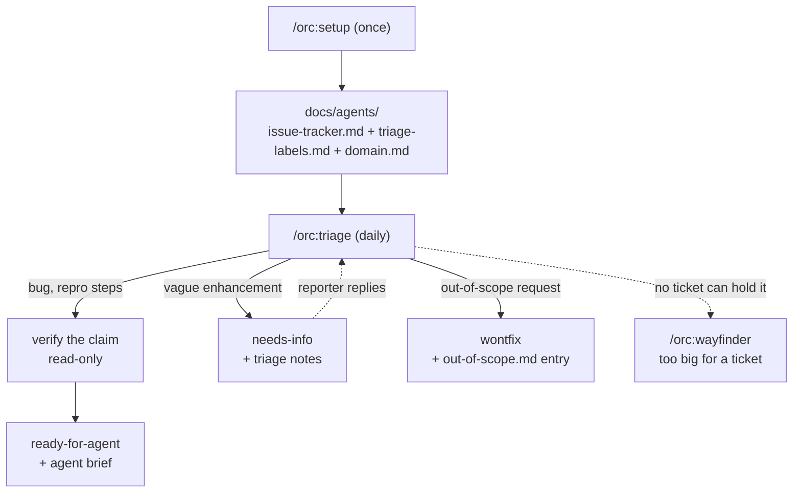

# 17 — Tracker setup and triage

## Scenario

Your repo `acme/checkout-api` is joining orc. Issues arrive on GitHub, but nothing tells orc's tracker-aware surfaces (`/orc:triage`, `/orc:wayfinder`, `orc:to-issues`, `orc:to-prd`) where issues live, what the label vocabulary is, or which domain docs to read first. That's `/orc:setup` — run once per repo. After that, triage is daily work: this morning three new items are sitting in the tracker.

## Flow



## Walk-through

### Act 1 — `/orc:setup` (run once)

**Phase 1 — Explore.** Setup looks before asking; every fact it settles removes a question:

```
- git remote: github.com/acme/checkout-api — gh authenticated, Issues enabled
- acli: not installed → Jira won't be recommended
- gh label list: no existing triage vocabulary
- docs/agents/: absent → fresh run, not an update run
- no pnpm-workspace.yaml / turbo.json / populated packages/* → single-context
```

**Phase 2 — Interview**, recommended answer first.

```
> **⛔ Gate — issue tracker**
>
> GitHub remote + authenticated gh found; Issues enabled on acme/checkout-api.
> Recommended: GitHub Issues.
```

You answer with one word: **GitHub**. Jira wasn't recommended — no usable `acli` means no Jira recommendation.

Section B — labels: no existing vocabulary was found, so exactly one question: *keep the default triage labels?* (`needs-triage`, `needs-info`, `ready-for-agent`, `ready-for-human`, `wontfix`, plus `bug` / `enhancement`). **Yes.**

Section C — domain docs: never asked. No monorepo signals → single-context (`CONTEXT.md` + `docs/adr/` at the root) is written automatically, with a one-line note saying so. That's the auto-skip: setup only asks single- vs multi-context when it actually finds workspace signals.

**Phase 3 — Preview.** `📋 Preview — tracker layer`, followed by full drafts of `docs/agents/issue-tracker.md` (GitHub seed from `orc:tracker-config`'s templates: `gh` conventions, "PRs as a request surface: no", wayfinding operations), `triage-labels.md` (role → label-string table), `domain.md`, and the `## Agent skills` block. Confirm: **Write them**.

**Phase 4 — Write.** The three files land in `docs/agents/`; `CLAUDE.md` exists, so the `## Agent skills` block goes there (with neither `CLAUDE.md` nor `AGENTS.md` present, setup asks which to create — never picks silently). No labels created, no issues filed, no `.orc/` state — the written files ARE the durable state.

```
> **➡️ Next**
>
> Unlocked: /orc:triage, /orc:wayfinder, orc:to-issues, orc:to-prd.
> Day-to-day edits go straight into docs/agents/*.md — re-run setup only to switch trackers.
```

### Act 2 — `/orc:triage` (daily)

```
/orc:triage "show me anything that needs my attention"
```

Phase 0 runs the shared `orc:tracker-config` read protocol on `issue-tracker.md` + `triage-labels.md` (tracker: GitHub via `gh`; its one canonical missing-config gate stays silent — Act 1 wrote the layer) and reads `domain.md`'s consumer rules for every codebase look below. The attention queue:

```
Unlabeled (3):
  #101  Tax not recalculated when shipping country changes   [issue]  2d
  #102  Search is bad, please improve                        [issue]  1d
  #103  Add a public GraphQL API                             [issue]  5h
needs-triage (0) · needs-info with reporter activity (0)
```

#### #101 — bug with repro steps → `ready-for-agent`

Gather context: full body and comments, codebase exploration in the glossary's vocabulary, a redundancy check (no existing recalculation on country change), and an `out-of-scope.md` check (file doesn't exist yet — no prior rejections).

```
> **⛔ Gate — triage recommendation**
>
> bug + likely ready-for-agent — repro steps are concrete.
> Recommend verifying the claim first.
```

**Verify the claim — read-only.** Reproduce from the reporter's steps: add an item, set shipping country CH, switch to DE — the total keeps Swiss VAT. **Confirmed**, with the code path: totals are cached per cart and an address change never invalidates them. No fix is attempted — investigate, don't fix.

Outcome: `bug` + `ready-for-agent`. Every write sits behind `📋 Preview — tracker writes` (labels + comment shown verbatim, then confirmed). The posted brief, in full:

```markdown
## Agent Brief

**Category:** bug
**Summary:** cart totals must recalculate tax when the shipping country changes

**Current behavior:**
Changing the shipping country after items are in the cart leaves the previous
country's VAT in the displayed and charged total. Verified: cached totals are
never invalidated on address change.

**Desired behavior:**
Any shipping-country change recomputes tax at the new country's rate before
the total is shown or charged. No stale rate survives an address edit.

**Key interfaces:**
- `CartTotals` — must derive from the current shipping address, not a cache
  that outlives address edits
- `recalculateTotals()` — contract becomes: runs (or is made unnecessary) on
  every shipping-address mutation

**Acceptance criteria:**
- [ ] Cart priced with a CH address then switched to DE shows DE VAT
- [ ] Regression test covers an address change after totals were computed
- [ ] Checkout charges the recomputed total, never the cached one

**Out of scope:**
- Tax-rate tables — rates are correct; only invalidation is broken
- Currency conversion
```

Durable over precise: interfaces and behavioral contracts, no file paths or line numbers — the issue may sit for weeks while the codebase moves.

#### #102 — vague enhancement → `needs-info` round-trip

"Search is bad" can't be grilled into shape without the reporter. Outcome: `enhancement` + `needs-info`, with triage notes (previewed first):

```markdown
## Triage Notes

**What we've established so far:**

- Search today is prefix-match on product title only — no descriptions, no fuzziness

**What we still need from you (@reporter):**

- A query you ran, and the result you expected instead
- Is the problem missing results, wrong ranking, or slowness?
```

Specific, answerable questions — never "please provide more info". When the reporter replies, tomorrow's attention queue surfaces #102 in the third bucket (`needs-info` with reporter activity since the last notes) and it flows back through `needs-triage`.

#### #103 — out-of-scope request → `wontfix` + knowledge base

A public GraphQL API contradicts a standing decision: the REST surface is the compatibility contract, and a second query surface doubles every schema change. Rejected. Because it's a **rejected enhancement** — not a bug, not already-built — the close also writes institutional memory to `docs/agents/out-of-scope.md`:

```markdown
## Public GraphQL API

This project exposes REST only; no second query surface.

**Why out of scope:** every schema change would ship and version twice; the
REST surface is the compatibility contract. Durable reasons only — this is a
rejection, not a deferral.

**Prior requests:** #103
```

The closing comment links this entry. The payoff comes later: step 1 of every future triage reads this file and matches by *concept*, not keywords — "expose a gql endpoint" surfaces the entry, and the maintainer confirms in one word instead of re-litigating.

### When work outgrows tickets

Triage handles tickets you can write today. When something lands that's too big and too foggy for that — "migrate checkout to usage-based billing" — no agent brief can hold it, because the open questions are *decisions*, not slices of a build. That's `/orc:wayfinder`: it charts a shared map on the tracker setup configured (the "Wayfinding operations" section of `issue-tracker.md` says where maps, child tickets, and blocking edges physically live), fills the map with decision tickets, keeps what can't be pinned down yet in a fog-of-war section, and resolves one decision per session until the route is clear — then hands off to `/orc:plan` or `orc:to-issues`.

```
> **➡️ Next**
>
> Too big for tickets you can write today → /orc:wayfinder "usage-based billing"
```

## Artifacts

```
docs/agents/
├── issue-tracker.md      # Act 1 — GitHub Issues, gh conventions, wayfinding ops
├── triage-labels.md      # Act 1 — canonical role → label-string table
├── domain.md             # Act 1 — single-context, written without asking
└── out-of-scope.md       # Act 2 — rejected enhancements only

CLAUDE.md                 # ## Agent skills block pointing at docs/agents/

GitHub:
- #101  bug + ready-for-agent, agent brief comment
- #102  enhancement + needs-info, triage notes comment
- #103  closed wontfix, close comment links the out-of-scope entry

.orc/                     # untouched — neither command keeps session state here
```

## Done when

- The three `docs/agents/*.md` files and the `## Agent skills` block are committed.
- Every triaged item carries exactly one category role and one state role.
- Every tracker write went through a `📋 Preview — tracker writes` gate.
- The agent brief names interfaces and testable criteria — no file paths, no line numbers.
- The rejected enhancement has an `out-of-scope.md` entry, linked from its close comment.

## Variants

- **Jira shop** — `/orc:setup --tracker jira` skips the Section A question and asks only the project key (validated `^[A-Z][A-Z0-9_]*$`). Jira is recommended only when `acli` is installed *and* `acli jira auth status` passes. Triage state is applied as Jira **labels**, not workflow statuses — portable across site-specific workflows — and label strings use hyphens (Jira labels can't contain colons or spaces).
- **Solo repo, no remote** — pick local markdown: issues are committed files under `docs/issues/<slug>/issues/NN-<slug>.md` with `Status:` / `Category:` lines; `/orc:triage` edits those lines and appends conversation under `## Comments`. Same state machine, zero services.
- **Switching trackers later** — re-run `/orc:setup`. Phase 1 finds the existing `issue-tracker.md` and treats it as an update run: keep, tweak, or restart — never overwriting your edits without a diff-level preview. Day-to-day tweaks don't need setup at all; edit `docs/agents/*.md` directly.
- **An external PR arrives** — a PR is an issue with attached code. Flip `PRs as a request surface` to `yes` in `issue-tracker.md` and discovery includes external PRs (author association `CONTRIBUTOR` / `FIRST_TIME_CONTRIBUTOR` / `NONE`); a PR you name explicitly is always triaged regardless. Verify-the-claim becomes: check out the branch, run the tests, switch back. `ready-for-agent` means the brief asks an agent to finish or fix the diff, not build from scratch.

## Iron rules in play

- **No tracker write without the preview gate.** Every label, comment, and close in Act 2 was shown verbatim and confirmed first.
- **Verify-the-claim is read-only.** #101 was reproduced and traced, never fixed — the fix is `/orc:debug` or `/orc:flow` work, seeded by the brief.
- **Setup writes config files only.** No labels or issues are created during `/orc:setup`, and only trackers whose CLI proved usable in Phase 1 get recommended.
- **No AI attribution** in any posted brief, note, or close comment.
- **State lives where collaborators see it.** Neither command writes `.orc/` session state — setup's durable state is `docs/agents/*.md`; triage's lives on the tracker itself.
