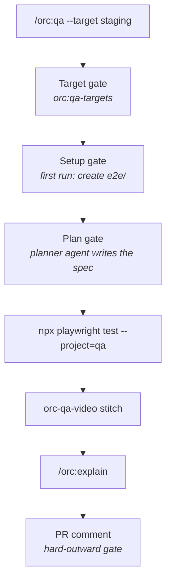

# 18 — Playwright QA and the explainer

## Scenario

`feat/csv-export` (PROJ-123) adds a "Download CSV" button to the reports page. You want browser QA against staging with a login, a single step-tagged video for the PR, and a narrated walkthrough for the reviewer.

## Flow



## Walk-through

**1. Target gate.** Remote targets are probed, never provisioned. `staging` is guarded, so mutating scenarios are off.

```
> ⛔ Gate — QA target
  local — boots the Docker env
  staging — https://staging.example.com (read-only)   <- selected
  New remote URL
```

**2. Setup gate (first run only).**

```
> ⛔ Gate — Playwright project
  No Playwright project here. Create e2e/ (config with setup/qa/demo projects) and install
  @playwright/test + Chromium (~150 MB)?   [Create e2e/ and install (Recommended)]
```

Login runs once in the `setup` project as the target's named user (`ORC_QA_USER`), with video and trace off. Credentials stay as references (`op://…`, `env:VAR`) and never land in a packet file.

**3. Plan gate.** Preview is `e2e/specs/csv-export.md`:

```
1. AC 3.1 — Download CSV is visible on /reports        @golden
2. AC 3.2 — CSV has one row per visible report row     @golden
3. AC 3.3 — Export of an empty report is disabled
```

**4. Run.**

```
$ npx playwright test --project=qa
  3 passed (41s)
```

**5. Stitch.**

```
$ orc-qa-video stitch --results .orc/feat-csv-export/files/qa/pw/results.json --qa-dir .orc/feat-csv-export/files/qa --branch feat-csv-export
.orc/feat-csv-export/files/qa/qa-feat-csv-export.webm
.orc/feat-csv-export/files/qa/chapters.json
```

Title cards need an ffmpeg with libfreetype. Without it the cards are blank and the titles stay in `chapters.json`.

**6. Manifest excerpt.**

```json
"driver": "playwright",
"target": "staging",
"video": {
  "file": "qa-feat-csv-export.webm",
  "chapters": [
    { "id": "t1", "title": "AC 3.1 — Download CSV is visible", "outcome": "passed", "start": 3.0, "end": 9.4 },
    { "id": "t2", "title": "AC 3.2 — CSV has one row per row", "outcome": "passed", "start": 12.4, "end": 21.8 }
  ]
}
```

**7. `/orc:explain`.** The Explainer gate previews the script before anything renders:

```
> ⛔ Gate — explainer
  5 segments, ~48s, style isometric, voice af_heart.
  s1 · title   · "CSV export"    · "Reports can now be exported as CSV."
  s2 · clip    · AC 3.1          · "The button sits above the table."
  s3 · graphic · "Row mapping"   · "Each visible row becomes one line."
  [Render (Recommended)]  [Edit script]  [Cancel]
```

Clips come from a separate golden-path `demo` pass with overlays off. Graphic scenes are authored by the session per `orc/lib/explain/animate.lock`, then built with `ORC_ANIMATE_RENDER=1`. Narration is local kokoro-js.

**8. PR comment preview.** One hard-outward gate:

```
> ⛔ Gate — post PR comment
  | Criterion | Verdict |
  |-----------|---------|
  | AC 3.1    | passed  |
  | AC 3.2    | passed  |
  | AC 3.3    | passed  |
  Links: stitched video, explainer (kept local), traces.   [Post]  [Edit]  [Skip]
```

## Artifacts

`qa/qa-feat-csv-export.webm`, `qa/chapters.json`, `qa/trace-<id>.zip`, `qa/pw/results.json`, `explain/segments.json`, `explainer-feat-csv-export.mp4`, plus committed `e2e/specs/` and `e2e/tests/`.

## Done when

All acceptance criteria are scored from the run, the stitched video and chapters are in the manifest, and the PR comment is posted or skipped on purpose.

## Variants

- **Local instead of staging** — pick `local`; orc boots the Docker env as before.
- **No Node** — orc announces and falls back to `agent-browser` (see example 10).
- **No animate plugin** — graphic segments render as fallback cards.

## Iron rules in play

- **No QA claim without artifacts.** The video, traces and results are the evidence.
- **Guarded targets never run mutating scenarios.**
- **Secrets never in packet files.**
- **Outward posts are gated.** The PR comment is shown verbatim first.
- **No AI attribution** in the posted comment.
