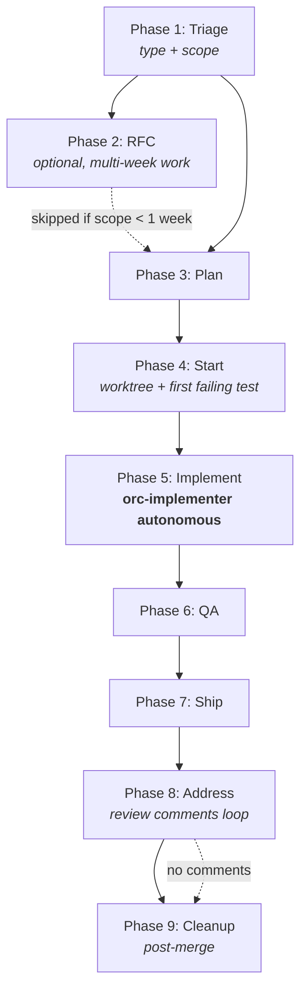

# 00 — End-to-end with `/orc:flow`

## Scenario

You want orc to drive the whole feature lifecycle. One command — gates at every *decision* phase via `AskUserQuestion`, autonomous (`orc-implementer`) at the *implementation* phase, resumable across days.

The split is deliberate: decisions need you in the loop (which design? did the QA pass? open as draft or as-is?). Writing the code from a clear plan + failing test is mechanical enough that the implementer agent can drive it slice-by-slice and only escalate when something genuinely needs your call.

## The single command

```
/orc:flow --jira JRA-123 "add CSV export to reports page"
```

That's it. orc walks the rest — gates where they matter, autonomy where it doesn't. The `--jira` flag is optional; if omitted, Phase 1 asks once whether to link a ticket. Either way the key persists in `.orc/` state and lands as `Resolves <KEY>` in the PR body.



## The full session — what you'll see

### Day 1 — morning

```
You: /orc:flow --jira JRA-123 "add CSV export to reports page"

orc: ⚙ Phase 1 — Triage
     Linked Jira: JRA-123 (--jira flag passed; link prompt skipped).

     What kind of work?
     ┌───────────────────────────────────────────────────┐
     │ ◉ feature                                          │
     │ ○ bug                                              │
     │ ○ refactor                                         │
     │ ○ docs                                             │
     │ ○ something else / let me describe                 │
     └───────────────────────────────────────────────────┘

You: feature

orc: Scope?
     ┌───────────────────────────────────────────────────┐
     │ ○ < 1 day                                          │
     │ ◉ 1–5 days                                         │
     │ ○ 1–4 weeks (recommend --rfc)                      │
     │ ○ multi-quarter (too big — break down first)       │
     └───────────────────────────────────────────────────┘

You: 1–5 days

orc: ⚙ Phase 1 done. Initialized .orc/feat-csv-export/files/.
     jiraTicket: JRA-123 written to .orc/orc.json + checkpoint.md.
     ⚙ Phase 2 (RFC) — skipped (scope < 1 week, no --rfc).
     ⚙ Phase 3 — Plan
     [invokes orc:writing-plans, drafts plan to .orc/feat-csv-export/files/plan.md]
     [shows you the plan: 4 vertical slices, 3 parallel-safe]

     Plan looks good?
     ┌───────────────────────────────────────────────────┐
     │ ◉ Yes — proceed                                    │
     │ ○ Iterate on the plan                              │
     │ ○ Add --grill stress-test                          │
     │ ○ Decompose into issues (orc:to-issues)            │
     │ ○ Abort                                            │
     └───────────────────────────────────────────────────┘

You: Yes — proceed

orc: ⚙ Phase 4 — Start
     [invokes orc:using-git-worktrees → .orc/.worktrees/orc/feat-csv-export]
     [invokes orc:tdd → writes failing test for slice 1]
     [runs the test → fails with "Cannot find module '../export/csv'"]
     [commits the failing test on branch feat/csv-export]

     Failing test ready. Test:
       src/reports/__tests__/export.test.ts:14 — "exports report rows to CSV"
       Failure: ENOENT — module './export/csv' not found.

     Continue?
     ┌───────────────────────────────────────────────────┐
     │ ◉ Test fails as expected — ready to implement      │
     │ ○ Failure isn't right — iterate                    │
     │ ○ Skip TDD (with rationale)                        │
     │ ○ Abort                                            │
     └───────────────────────────────────────────────────┘

You: Test fails as expected

orc: ⚙ Phase 5 — Implementation
     [dispatching orc-implementer (sonnet) with plan, failing test, branch context]

     ✓ Slice 1 — "GET endpoint scaffolding"
       Files: src/reports/api.ts, src/reports/__tests__/api.test.ts
       Tests: 48 pass, 0 fail (added 1)
       Commit: a3f7b21 — feat(reports): scaffold CSV export endpoint

     ✓ Slice 2 — "CSV serialization"
       Files: src/reports/csv.ts, src/reports/__tests__/csv.test.ts
       Tests: 51 pass, 0 fail (added 3)
       Commit: b8e2c4d — feat(reports): add CSV serialization

     ✓ Slice 3 — "Wire UI export button"
       Files: src/reports/components/Header.tsx, plus 2 test files
       Tests: 55 pass, 0 fail (added 4)
       Commit: c1d9f88 — feat(reports): wire export button in header

     ✓ Slice 4 — "Update API docs"
       Files: docs/reference/api.md
       Tests: 55 pass, 0 fail (no new tests — docs slice)
       Commit: d4ac2e1 — docs(api): document CSV export endpoint

     ✓ Implementation complete: feat-csv-export
       Slices: 4/4 complete
       Total commits: 4
       Tests: 47 → 55 (added 8, all green)
       Files changed: 8

     Ready for Phase 6 (QA).

You: (had lunch while orc-implementer worked)
```

### Day 1 — afternoon

You come back from lunch. orc-implementer drove all 4 slices autonomously while you were away. The agent followed the same iron rules you'd have followed yourself: no commits to main (worktree + feature branch), test-first per slice, full suite green between slices, Conventional Commits via `orc:git-commit`, no AI attribution. Worktree state visible via `git log` on the feature branch.

If at any slice the agent had hit an escalation condition (ambiguous spec, dep needed, test stuck after 3 attempts, scope creep, pre-existing test broke) — it would have stopped with a `[!CAUTION]` `🛑 Escalation — slice <N>` callout and `AskUserQuestion` would have surfaced the choice to you. None did, this run.

(If you'd passed `--pause-at-implement` instead, orc would have paused and you'd write the code yourself in conversation, exactly as the original walk-through described.)

### Day 2 — morning

```
You: /orc:flow

orc: 📍 Resuming flow for feat-csv-export · [JRA-123] from .orc/orc.json
     Last completed phase: 5 (implementation)
     Next: Phase 6 — QA

     Diff scan: 3 .tsx files changed → web mode auto-detected.
     Continue?
     ┌───────────────────────────────────────────────────┐
     │ ◉ Yes — run full QA (tests + lint + types + browser)│
     │ ○ Code-only mode (skip browser — only if no UI)    │
     │ ○ Pause flow (come back later)                     │
     └───────────────────────────────────────────────────┘

You: Yes

orc: ⚙ Phase 6 — QA
     [tests] 47 pass, 0 fail.
     [lint] 0 errors, 0 warnings.
     [types] 0 errors.
     [self-review via orc:caveman-review] no findings.
     [orc-qa-validator dispatched, drives agent-browser at localhost:3000]
     [walks golden path + 3 edge cases, captures evidence]

     QA verdict: PASS
     Artifacts: .orc/feat-csv-export/files/qa/
       - 7 screenshots (annotated)
       - snapshot-final.txt
       - console.log (0 errors / 1 warning)
       - network.har
       - steps.md

     Proceed to ship?
     ┌───────────────────────────────────────────────────┐
     │ ◉ Yes — ship it                                    │
     │ ○ I want to address something first (back to phase 5)│
     │ ○ Pause flow                                       │
     └───────────────────────────────────────────────────┘

You: Yes

orc: ⚙ Phase 7 — Ship
     [orc:requesting-code-review → no gaps vs plan]
     [orc:finishing-a-development-branch → option: open PR]
     [composes PR via caveman-pr (because --caveman was passed earlier)]

     PR title: feat(reports): add CSV export
     PR body:

       ## Why
       Customer-requested in support tickets #311, #389, #412.
       Plan in .orc/feat-csv-export/files/plan.md.

       ## How tested
       Tests: 47 pass. QA: .orc/feat-csv-export/files/qa/steps.md.

       Closes #311
       Resolves JRA-123

     Open?
     ┌───────────────────────────────────────────────────┐
     │ ◉ Open as-is                                       │
     │ ○ Edit title/body first                            │
     │ ○ Open as draft                                    │
     │ ○ Cancel                                           │
     └───────────────────────────────────────────────────┘

You: Open as-is

orc: ⚙ git push -u origin feat/csv-export
     ⚙ gh pr create --title "feat(reports): add CSV export" --body ...
     ✓ PR opened: https://github.com/you/repo/pull/523

     ⚙ Phase 8 — Address
     PR is open. Waiting for reviewer comments?
     ┌───────────────────────────────────────────────────┐
     │ ○ Wait — orc keeps the flow open                   │
     │ ◉ I'll come back later with /orc:flow              │
     │ ○ Done for this PR (skip cleanup readiness)        │
     └───────────────────────────────────────────────────┘

You: I'll come back later
```

### Day 2 — afternoon

Reviewers leave 4 comments overnight.

```
You: /orc:flow

orc: 📍 Resuming flow for feat-csv-export.
     PR #523: 4 unresolved review comments detected.
     Run address loop?
     ┌───────────────────────────────────────────────────┐
     │ ◉ Yes — categorize and fix                         │
     │ ○ Skip — I'll respond manually                     │
     └───────────────────────────────────────────────────┘

You: Yes

orc: ⚙ Phase 8 (loop) — Address
     [fetches comments via gh api, categorizes]
     ACTION: 2  QUESTION: 1  NITPICK: 1  DISAGREE: 0

     Categories look right?
     [...you confirm or re-categorize...]

     [dispatches orc-code-fixer + orc-reply-drafter in parallel]
     [shows you the diff + drafted replies]

     Looks good?
     ┌───────────────────────────────────────────────────┐
     │ ◉ Commit, push, post replies                       │
     │ ○ Edit replies                                     │
     │ ○ Edit fix                                         │
     └───────────────────────────────────────────────────┘

You: Commit, push, post replies

orc: ✓ Pushed fix abc1234, posted 4 replies, re-requested review.

     Wait for the next review round?
     ┌───────────────────────────────────────────────────┐
     │ ○ Wait                                             │
     │ ◉ I'll come back when it's merged                  │
     └───────────────────────────────────────────────────┘
```

### Day 3 — afternoon (PR merged)

```
You: /orc:flow

orc: 📍 Resuming. PR #523 status: MERGED at 2026-05-03T14:22Z.
     ⚙ Phase 9 — Cleanup

     Plan:
     ✓ rm -rf .orc/feat-csv-export/
     ✓ git worktree remove .orc/.worktrees/orc/feat-csv-export   (clean)
     ✓ git branch -d feat/csv-export                   (merged into main)

     Apply?
     ┌───────────────────────────────────────────────────┐
     │ ◉ Apply as shown                                   │
     │ ○ Edit (skip individual items)                     │
     │ ○ Skip cleanup (keep state for reference)          │
     └───────────────────────────────────────────────────┘

You: Apply

orc: ✓ Worktree removed.
     ✓ Branch deleted.
     ✓ .orc/feat-csv-export/ removed.
     ✓ Registry updated (status: completed).

     ✓ Flow complete: feat-csv-export
       - plan.md         (4 slices, all green)
       - qa/             (7 screenshots, console.log, network.har, steps.md)
       - PR              (#523, merged 2026-05-03)
       - cleanup         (worktree gone, branch gone, .orc/ cleared)

     Total active time: ~1.2 days
     Active orc sessions remaining: 0
```

## What you noticed

- **Every phase asks before advancing.** No silent transitions. The select-from-list comes from `AskUserQuestion`.
- **The implementation phase is autonomous by default.** `orc-implementer` (sonnet) drives the slice-by-slice loop — read spec, confirm/write failing test, implement, run suite, commit, next slice. The agent obeys the same iron rules you would (no commits to main, test-first, verify, root-cause). Pass `--pause-at-implement` if you want orc to stop at Phase 4's failing test and let you write the code yourself instead.
- **Resume is automatic.** You don't pass any args on the second/third invocation — orc reads `.orc/orc.json`, finds the in-progress flow, jumps to the next pending phase.
- **The PR description was synthesized from accumulated evidence**: plan.md (Why), the diff (What changed), qa/steps.md (How tested), and ticket links.
- **Jira followed the work end-to-end.** `JRA-123` was bound at Phase 1 (via `--jira` flag), persisted in `.orc/orc.json` + `checkpoint.md`, surfaced in every resume header, and emitted as a `Resolves JRA-123` trailer at PR composition. Override the keyword with `ORC_JIRA_PR_KEYWORD=Closes` (or `Fixes`) per shop convention.

## Variants

- **You want to write the code yourself** — pass `--pause-at-implement`. Phase 5 stops at Phase 4's failing test and hands back to you (the original behavior). Useful for exploratory refactors, learning a new codebase, or UI tweaks that are easier to do interactively. Everything else (gates, /orc:resume, autonomous QA dispatch, /orc:cleanup) stays the same.
- **Bug instead of feature** — phase 3 becomes `/orc:debug`. The diagnosis substitutes for the plan; orc-implementer drives the regression test → fix loop in Phase 5.
- **Multi-week effort** — pass `--rfc` (or pick "1–4 weeks" in triage) to insert phase 2 (RFC drafting) before planning. The RFC produces alternatives and a decision deadline before any code is touched.
- **Docs only** — pass `--type=docs`. Phases 4 (TDD start) and 5 (implementation) collapse into a docs-writing conversation; phase 6 runs lint only.
- **Verbose PR** — drop `--caveman`. Phase 7 uses the default verbose template with What/Why/How tested/Checklist sections.
- **You want fine-grained control over a single phase** — invoke the per-phase commands directly (`/orc:plan`, `/orc:debug`, `/orc:qa`, `/orc:ship`, etc.) instead of `/orc:flow`. Useful when only one phase of the loop is interesting and the rest is already done.
- **No Jira ticket yet (or this work has no tracker entry)** — drop `--jira`. Phase 1 asks once with options `Paste a key` / `Skip — I'll bind later via /orc:jira bind` / `No ticket`. The rest of the flow behaves identically; the `Resolves <KEY>` trailer is just omitted from the PR body. You can attach a ticket mid-flow with `/orc:jira bind <KEY>` from the worktree.
- **Need to file the Jira ticket from inside the flow** — pause at Phase 1, run `/orc:jira create --summary "add CSV export" --project PLAT --type Story` (it will offer to bind the new key automatically), then re-run `/orc:flow` and pass `--jira <NEW-KEY>`. End-to-end walkthrough in `examples/12-link-jira-and-ship.md`.

## Iron rules in play

- **Every gate is a real gate.** `/orc:flow` never silently advances.
- **Phase state is durable.** Crash mid-flow, resume tomorrow.
- **Per-phase rules still apply** — web QA evidence, blameless framing, no AI attribution, no commits to main. `/orc:flow` doesn't bypass them; it composes them.
- **Implementation is autonomous by default but escalates honestly.** `orc-implementer` runs the whole loop without your involvement — UNTIL it hits an escalation condition (test stuck after 3 attempts, ambiguous spec, new dependency, scope creep, broken pre-existing test, security concern, plan-is-wrong). When it escalates, it surfaces a `[!CAUTION]` `🛑 Escalation` callout with concrete options and a recommended path. You stay out of the loop until the agent genuinely needs you.
