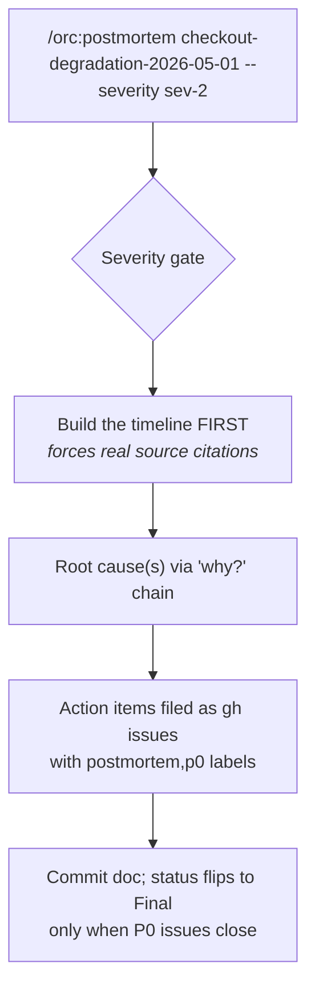

# 02 — Writing an incident postmortem

## Scenario

Last night, a deploy at 22:01 caused checkout to return 500 for ~5 minutes before someone rolled back. Customer impact: 47 failed checkouts, ~$1,800 of declined revenue. The on-call engineer paged the team lead at 22:09 once they noticed it wasn't a transient blip.

This morning, you need to write the postmortem.

## Flow



## Walk-through

### Phase 1 — Gate

`/orc:postmortem` confirms the incident is real. The thresholds are:

- customer-visible (yes — 47 failed checkouts)
- on-call paged (yes)
- recurrence (no, but the first two are enough)

Proceeds.

### Phase 2 — Severity

You passed `--severity sev-2`. If you'd omitted it, `AskUserQuestion` would propose a tier and confirm.

### Phase 3 — Init workspace

Creates `.orc/checkout-degradation-2026-05-01/files/` and writes `checkpoint.md`. Decides where the doc lives — for engineering-only postmortems, `docs/postmortems/2026-05-01-checkout-degradation.md`.

### Phase 4 — Timeline FIRST

Critical step. The model does NOT paraphrase from memory. It asks you to surface:

- chat transcript (e.g. Slack #incidents)
- pager log (PagerDuty)
- deploy log
- dashboard screenshots (Datadog / Grafana)
- status-page edits

Then it builds the table:

```
| Time   | Event                                          | Source         |
|--------|------------------------------------------------|----------------|
| 22:01  | Deploy 4f7e2a went to prod                     | deploy log     |
| 22:03  | Checkout error rate climbs from 0.02% → 38%    | datadog       |
| 22:08  | First customer support ticket arrives          | Zendesk        |
| 22:09  | On-call ack'd page                             | PagerDuty      |
| 22:14  | Cause identified (config typo in payment SDK)  | runbook        |
| 22:17  | Rollback initiated                             | deploy log     |
| 22:21  | Error rate back to baseline                    | datadog       |
| 22:25  | Status page updated, incident closed           | status page    |
```

### Phase 5 — Root causes

Walks the "why?" chain. Uses **roles, not names** in causal language. The skill refuses to draft a section that names an individual as cause.

```
- **RC1 (technical):** payment SDK config key was renamed in 4.x; our app
  passed the 3.x key, which silently failed validation, returning a
  default-rejected SDK instance.
- **RC2 (system):** SDK upgrade from 3.7 to 4.0 was a routine dependency
  bump; the diff didn't include the config-key rename because the rename
  was documented only in a CHANGELOG section we don't auto-parse.
- **RC3 (organizational):** dependabot PRs are merged after green CI, but
  CI doesn't exercise the live payment integration (we use a mock there
  for cost reasons).
```

### Phase 6 — Action items + file as issues

Each action item gets owner / severity / tracking link / done-when. The command runs `gh issue create` for each P0:

```bash
gh issue create \
  --title "Postmortem AI: add live-payment-sandbox check to CI for SDK upgrades" \
  --body "..." \
  --label "postmortem,p0"
```

The command captures the issue URL and pastes it back into the postmortem doc.

Refused: "be more careful when reviewing dependabot PRs." That's not an action item; it's a vibe.

### Phase 7 — Place + commit

Commit to `docs/postmortems/2026-05-01-checkout-degradation.md` with status `Action items in flight` (P0 issues are filed but not closed).

## Artifacts

```
docs/postmortems/2026-05-01-checkout-degradation.md     # the doc
.orc/checkout-degradation-2026-05-01/files/
├── checkpoint.md
├── postmortem-checkout-degradation-2026-05-01.md       # workspace draft
└── progress.md
```

Plus, on GitHub:

```
postmortem,p0 issues filed: 3
- #482 Add live-payment-sandbox check to CI for SDK upgrades
- #483 Auto-flag dependency PRs that touch payment paths for manual review
- #484 Update runbook step 6 to include "verify SDK config-key version"
```

## Done when

- The timeline is complete with cited sources (chat / pager / dashboard).
- Root causes go 3-5 "why?" deep until "fix this" is a credible action item.
- Every P0 action item is filed as a tracker issue with a `postmortem,p0` label.
- The doc is committed with status `Action items in flight`.

**Status flips to `Final` only when** `gh issue list --label postmortem,p0 --state open` returns empty (or you explicitly punt a P0 with documented rationale).

## Variants

- **Near-miss** (caught before customer impact, but real defect) — same flow, mark severity SEV-3 and adjust the customer-impact line to "near-miss; no customer impact." The postmortem still produces action items.
- **Recurring incident** (third time this month a Postgres connection pool exhausts) — write the postmortem framed around *why we keep recurring*, not the specific mechanism. The action items target the recurrence (capacity model, alerting, runbook), not just the proximate cause.
- **Multi-team incident** — file action items to the right teams' trackers. Cross-link from the postmortem.

## Iron rules in play

- **Blameless framing is non-negotiable.** Roles, not names. The skill refuses anything else.
- **#5 — No AI attribution.** Postmortems are engineering-team-authored. No "drafted by Claude" trailer.
- **Action items are the deliverable, not the narrative.** A great narrative with vague action items is a failed postmortem.
