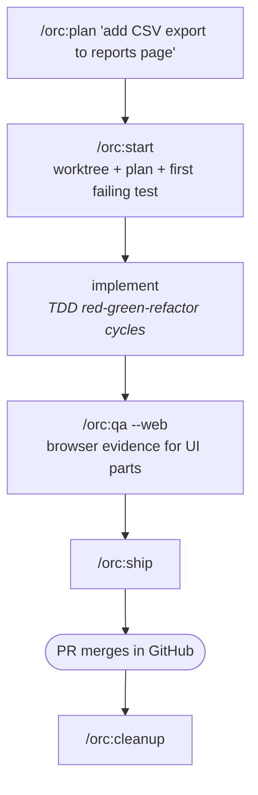

# 03 — Adding a new feature

## Scenario

PM dropped a request: *"Let users export their report data to CSV — they keep asking for it in support."* The feature is small but real. You'll do it today.

## Flow



## Walk-through

### Phase 1 — Plan

```
/orc:plan "add CSV export to reports page"
```

Composes `writing-plans` + (optionally) `grill-me` + `to-issues`. For a feature this size, skip `--grill` — the design space is small. For a multi-team feature, add `--grill` to surface hidden assumptions before they bite.

Output: `.orc/feat-csv-export/files/plan.md` — a TDD-shaped plan with vertical-slice tasks marked parallel-safe where applicable.

Example plan tasks:

```
1. (slice) GET /api/reports/<id>/export.csv endpoint — return text/csv with content-disposition
2. (slice) Wire button in reports header — calls endpoint, triggers download
3. (slice) Add e2e test for end-to-end happy path
4. (parallel) Update docs/reference/api.md
```

`AskUserQuestion`: looks good — proceed / iterate first.

### Phase 2 — Start

```
/orc:start
```

Composes `using-git-worktrees` + `writing-plans` (re-loads from `.orc/`) + `tdd`. Creates an isolated worktree (pinned under `.orc/.worktrees/`, e.g. `.orc/.worktrees/orc/feat-csv-export`), creates the feature branch (`feat/csv-export`), drafts the first failing test from slice 1.

From here on, any commit to `main` triggers the PreToolUse hook's confirm prompt — the feature branch is the only frictionless path.

### Phase 3 — Implement

You're now in the worktree on a feature branch with a failing test. Implement until the test goes green. Repeat for each slice. Each slice = one commit (orc:git-commit applies Conventional Commits style, deduces `feat(reports):` from the diff).

### Phase 4 — QA

```
/orc:qa --web http://localhost:3000
```

For a feature with UI (the export button), web mode is required. `orc-qa-validator` walks:

- Golden path: open a report, click Export, confirm CSV downloads with the right rows.
- Edge cases: empty report (no rows), large report (1000+ rows — does it stream?), permission-denied report.

Captures `.orc/feat-csv-export/files/qa/{screenshots, console.log, network.har, steps.md}`.

### Phase 5 — Ship

```
/orc:ship
```

Composes `verification-before-completion` (final tests/lint/type-check) + `requesting-code-review` (gap check vs the plan) + `finishing-a-development-branch` (offers structured options) + `git-commit` (if uncommitted) + `gh pr create`.

PR body auto-includes:
- Summary from the plan
- "How tested" pointing at `.orc/feat-csv-export/files/qa/`
- Link to the plan

### Phase 6 — Cleanup (post-merge)

After the PR merges in GitHub:

```
/orc:cleanup
```

Removes the worktree (clean), the local branch (merged into main), and the `.orc/feat-csv-export/` directory. Updates the central `.orc/orc.json` registry.

## Artifacts

```
.orc/feat-csv-export/files/
├── checkpoint.md
├── plan.md
├── progress.md
└── qa/
    ├── screenshot-01-reports-loaded.png
    ├── screenshot-02-export-button-clicked.png
    ├── screenshot-03-csv-downloaded.png
    ├── screenshot-04-empty-report-edge.png
    ├── steps.md
    ├── console.log
    └── network.har
```

## Done when

- The plan was followed and every slice has a passing test.
- `qa/` contains the required browser-evidence artifacts (web mode).
- PR is open with the plan + QA artifacts linked.
- After merge: `/orc:cleanup` ran cleanly.

## Variants

- **Bigger feature (multi-week)** — start with `/orc:rfc` instead of `/orc:plan`. The RFC surfaces alternatives BEFORE you commit to a design. Once approved, run `/orc:plan --issues` to decompose into tickets, then `/orc:start` per ticket.
- **Backend-only feature (no UI)** — same flow, `/orc:qa` runs in code mode (no browser). Web QA hard rule doesn't apply.
- **Multi-developer feature** — use `/orc:fan-out` to dispatch the parallel-safe slices to different sub-sessions or teammates. Each slice has its own checkpoint.

## Iron rules in play

- **#1 — No commits to main.** The worktree+branch flow keeps you safe; the PreToolUse hook enforces it.
- **#2 — No code without a failing test first.** `/orc:start` literally exits with the test red; you can't skip this.
- **#6 — Multi-phase work writes to `.orc/`.** Resume across sessions via `/orc:resume`.
- **Web QA evidence rule.** UI changes need the artifacts.
