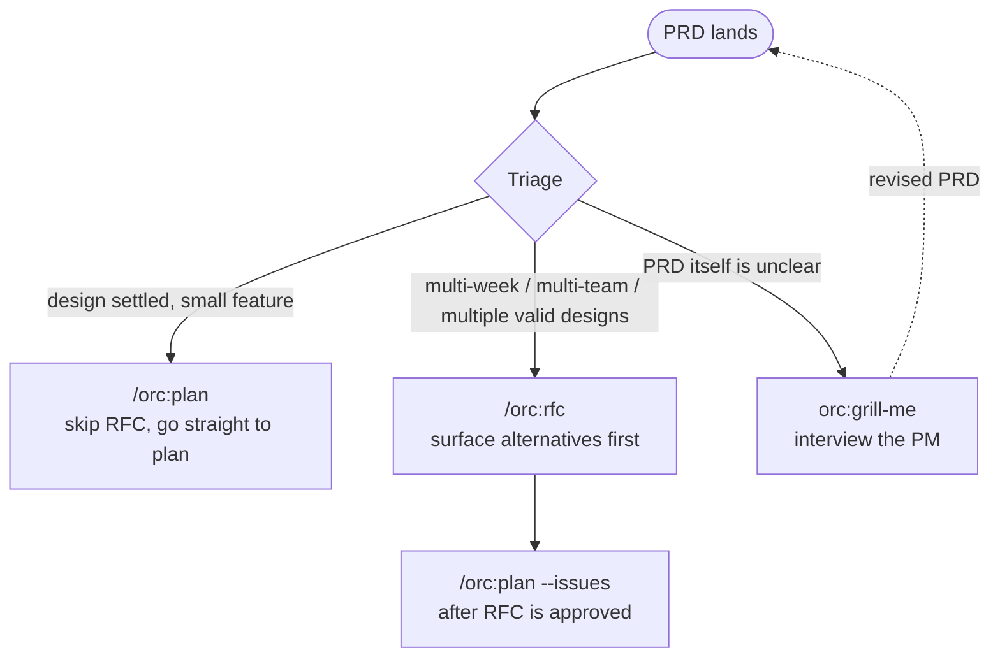

# 05 — Handling a PRD

> **Receiving vs. authoring** — this example is for *receiving* a PRD (PM hands you one). If you need to *author* a PRD from scratch, reach for **`/orc:prd`** instead (see `skills/prd-writing/SKILL.md`); for the *technical contract* downstream of a PRD, reach for **`/orc:trd`**.

## Scenario

PM hands you a PRD: *"In-app notifications system — users see a bell icon with unread count, click to see a list, mark read, etc."* The PRD is 4 pages. You read it once, you have questions, and you need to decide whether to start coding or float a design first.

orc maps this to a triage flow.

## The triage decision



**Apply the RFC test.** If ≥ 2 weeks of effort OR multiple teams OR genuine uncertainty between alternatives — write the RFC.

## Flow (the most common case: medium PRD, RFC then plan)

```
1. orc:grill-me      ← clarify PRD ambiguities first
2. /orc:rfc          ← surface alternatives, get team input
3. /orc:plan --issues ← decompose into vertical-slice issues
4. /orc:fan-out      ← parallel-safe issues dispatch
5. (per issue) /orc:start ... /orc:ship
6. /orc:cleanup
```

## Walk-through

### Phase 1 — Grill the PRD

Before coding or designing, surface the questions:

```
Skill: orc:grill-me
```

The skill drives an interview against the PRD. For "in-app notifications," questions might include:

- What's the spec for "unread"? Per-device? Per-user (synced)?
- Real-time push or polling? If push: which transport (WebSocket, SSE)?
- Retention policy — do notifications older than 30 days disappear?
- Permissions — can a user mute a channel?
- Mobile + web parity, or web first?

Either you answer (you know enough about the system) or you take the questions back to the PM. Update the PRD with answers.

### Phase 2 — RFC

```
/orc:rfc "in-app notifications system"
```

Multi-week feature, multi-component (storage, real-time delivery, UI), multiple valid designs. RFC test passes — proceed.

The RFC drafts:

- **Goals**: bell icon, unread count, click-to-list, mark read.
- **Non-goals**: email/SMS notifications (different system); user-to-user DMs (out of scope).
- **Background**: existing event bus, current user-prefs storage.
- **Proposed design**: event handler writes to a `notifications` table; UI fetches via SWR with a 30s polling fallback to WebSocket subscription.
- **Alternatives considered**: SSE vs WebSocket vs poll-only; one-table vs event-sourced.
- **Open questions**: does the existing event bus guarantee at-least-once or exactly-once? (depends on the next answer's impact)
- **Success criteria**: p95 notification-to-bell latency < 5s; 0% lost notifications under normal conditions.

Decision deadline: 1 week from today.

`AskUserQuestion`: open a GitHub Discussion thread for review or commit-only.

### Phase 3 — RFC approved, decompose

When the RFC moves to `Status: Approved`, run:

```
/orc:plan --issues "in-app notifications — implementation"
```

Plan reads from the approved RFC (which lives at `docs/rfcs/0007-in-app-notifications.md`). Composes `writing-plans` + `to-issues`.

Output: a TDD-shaped task list, then `to-issues` files each as a tracker issue with vertical-slice scoping.

### Phase 4 — Fan out parallel-safe issues

```
/orc:fan-out --from-plan
```

The plan marked which slices are parallel-safe (e.g. "DB migration", "API endpoint", "UI bell component" — all touch different files). Dispatches each as a sub-session.

### Phase 5 — Per-issue ship cycle

For each issue:

```
/orc:start <issue>
... implement ...
/orc:qa --web (web parts)
/orc:ship
```

### Phase 6 — Lock in any new architectural facts as ADRs

The RFC's design might lock in things worth ADR'ing — e.g. "use a single `notifications` table rather than event-sourcing." Record each as a separate ADR via `/orc:adr` so future reviewers find the why.

### Phase 7 — Cleanup

After all issues ship and merge:

```
/orc:cleanup --all-completed
```

Removes the .orc/ state for each completed session, the worktrees, the merged branches.

## Artifacts

```
docs/rfcs/0007-in-app-notifications.md          # the RFC
docs/adr/0008-notifications-storage-model.md    # post-RFC ADR
docs/adr/0009-realtime-delivery-via-websocket.md

.orc/<branch>/files/                            # per-issue workspace
├── checkpoint.md
├── plan.md
└── issues.md                                   # filed issue URLs

GitHub:
- 5 implementation issues (filed by /orc:plan --issues)
- 5 PRs (one per issue)
```

## Done when

- The RFC is `Approved` (or `Rejected` — that's also a valid PRD outcome).
- All decomposed issues are merged.
- New ADRs are committed for the durable decisions.
- `/orc:cleanup` ran and the worktrees/branches are gone.

## Variants

- **PRD is short, design is obvious** — skip the RFC. `/orc:plan` directly. Don't manufacture ceremony.
- **PRD has hard scope/timeline constraints** — the RFC's `Goals/Non-goals` is where you protect against scope creep. Push back via the RFC if the PRD is internally inconsistent (e.g. "this week, multi-team, real-time, with auth").
- **PRD requires customer migration** — the RFC's `Migration / rollout` section earns its keep. Force a 2-phase deploy plan, feature flag, rollback story before any code.
- **The PRD never lands** — sometimes the answer is "we shouldn't build this." A rejected RFC is a successful triage outcome. Mark it `Rejected`, leave the doc, link from any future PRD that revisits the question.

## Iron rules in play

- **#6 — multi-phase, multi-day work writes to `.orc/`.** Resume cleanly tomorrow via `/orc:resume`.
- **No code without a failing test.** Every issue's first commit is the failing test.
- **No commits to main.** Worktrees + branches per issue.
- **Web QA evidence.** Any UI-facing issue needs `/orc:qa --web` artifacts.
