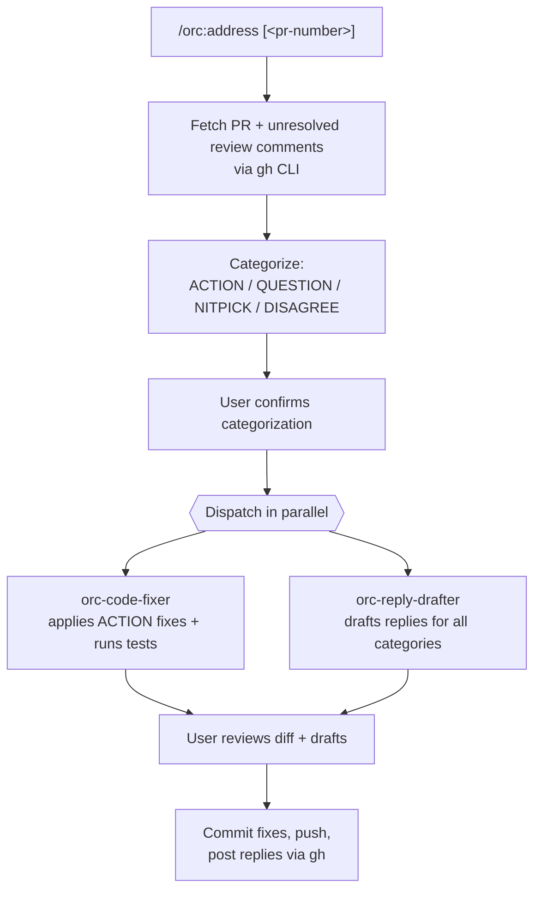

# 07 — Responding to PR feedback

## Scenario

You opened PR #88 yesterday. Overnight, three reviewers left 12 comments. Some are clear bugs you need to fix, some are questions, one is a nitpick about variable naming, one says "I think you should use a Map here" and you actually disagree.

orc handles all four categories in parallel.

## Flow



## Walk-through

### Phase 1 — Fetch context

```bash
gh pr view <ref> --json number,title,headRefName,url,reviewThreads
gh api repos/{owner}/{repo}/pulls/<n>/comments --paginate
```

If you didn't pass a PR number, `gh pr list --head $(git branch --show-current)` finds the PR for the current branch.

The command filters to **unresolved threads only** (using `isResolved: false` from the reviewThreads JSON).

### Phase 2 — Categorize

Each comment gets read alongside the relevant code (the model `Read`s the file ±20 lines around the comment line). Then categorizes:

```
1. src/cache.ts:88 — "this is off by one" → ACTION
2. src/cache.ts:120 — "why is this synchronous?" → QUESTION
3. src/util/format.ts:14 — "rename `x` to `count`?" → NITPICK
4. src/store/index.ts:42 — "you should use a Map here" → DISAGREE  (you actually weighed Map and Set, picked Set deliberately)
5. src/api/handler.ts:101 — "missing await" → ACTION
... etc
```

`AskUserQuestion`:

- "Categories look right — proceed"
- "Re-categorize: comment-id #N should be <category>"

### Phase 3 — Two agents in parallel

Single response with two `Task` calls (parallel execution):

**`orc-code-fixer`** receives the list of `ACTION` items with file/line/intended change. It:
- Reads each target file
- Applies the change minimally (no opportunistic refactors)
- Runs the project's test suite
- Returns: a diff + test pass/fail summary

**`orc-reply-drafter`** receives ALL comments + categories + (if available) the diff from the code-fixer. It drafts one reply per comment using these patterns:

```
ACTION: "Done — extracted the validation into its own helper. abc1234"
QUESTION: <direct answer in 1-3 sentences>
NITPICK (fixed): "Fixed."
NITPICK (skipped): "Going to leave this — <one line of why>. Happy to change if you feel strongly."
DISAGREE: <acknowledge in 1 sentence, explain in 1-2 with evidence, offer to discuss>
```

Returns a JSON list of `{comment_id, file, line, category, reply}`.

### Phase 4 — Review

Show the diff + drafted replies via `AskUserQuestion`:

- "Looks good — commit, push, post replies"
- "Edit replies" → re-prompt for which to edit
- "Edit fix" → return to Phase 3 with adjustments

**Iron rule from the skill: never post a reply that has not been shown to the user first.** The user is the engineer of record on every PR thread.

### Phase 5 — Commit + push + post

`orc:git-commit` produces:

```
fix: address PR review feedback

- src/cache.ts:88 — fix off-by-one
- src/api/handler.ts:101 — add missing await
- src/util/format.ts:14 — rename x → count
```

```bash
git push
# For each reply:
gh api repos/{owner}/{repo}/pulls/88/comments/<id>/replies -f body="..."
```

Optionally re-request review:

```bash
gh pr edit 88 --add-reviewer alice,bob
```

### Phase 6 — Confirm

Echo: "Addressed 12 comments. Fix commit `abc1234` pushed. 12 replies posted (5 ACTION, 4 QUESTION, 2 NITPICK, 1 DISAGREE). Re-requested review from alice, bob."

## Artifacts

`/orc:address` is **stateless from orc's perspective** — no `.orc/` writes. The fix commit + replies are the artifacts, on GitHub.

## Done when

- All ACTION items have a fix commit.
- All QUESTION items have a clear, short reply.
- All DISAGREE items have a reasoned reply (with evidence) offering to keep discussing.
- All NITPICK items got either a "Fixed." or a "Going to leave this — …" with a reason.
- The fix commit is pushed.
- Replies are posted.
- The reviewers know they should look again (re-request review).

## Variants

- **Reviewer asks for a big refactor** — that's not an ACTION item; it's a separate task. Reply: "Good call — I'll do this in a follow-up PR (filed as #<issue>)." Don't bundle major refactors into a "fix review feedback" commit.
- **Reviewer found a real bug, but the fix is non-trivial** — fix it in this PR, but the commit message says `fix:` and the reply links to the regression test you added. (Same flow as `/orc:debug` — root cause + regression test, just inline in the address flow.)
- **Multiple reviewers contradict each other** — surface to the user via `AskUserQuestion`. The user picks who to follow and replies to the other with a "We chose X — happy to discuss further" note.
- **Comments are on a PR you didn't open (someone else's PR you're co-authoring)** — same flow, but be explicit in the reply about which co-author is responding.

## Tone

- Engineer-to-engineer. Terse. Confident without arrogance.
- Read as if you wrote the reply on a Tuesday morning, not as if a tool drafted it.
- ≤ 4 sentences per reply.
- Never "actually" or "with respect" or "as an AI".

## Iron rules in play

- **No AI attribution.** PR replies are your voice.
- **#3 — verify before claim.** Tests run as part of `orc-code-fixer`'s output; if they fail, the reply ACTION items can't say "Done" yet.
- **Reply categories are non-negotiable.** Skipping the categorization step (just blasting "I'll fix all of these") leads to drafts that can't tell QUESTION from DISAGREE.
