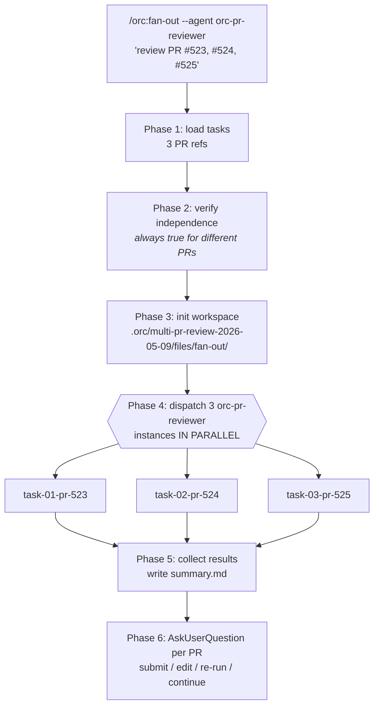

# 11 — Reviewing multiple PRs in parallel with `/orc:fan-out`

## Scenario

It's Friday afternoon. Three teammates opened PRs throughout the week and all of them have you down as a reviewer:

- `#523` — `feat(reports): add CSV export` (alice, ~480 lines, 27 files)
- `#524` — `fix(billing): correct proration on plan changes` (bob, ~120 lines, 6 files)
- `#525` — `refactor(auth): split session middleware` (carol, ~310 lines, 14 files)

Doing them sequentially with `/orc:code-review` is ~30–45 min each. Doing them in parallel — three `orc-pr-reviewer` instances running simultaneously — finishes in the wall-clock time of the slowest review, ~one third the elapsed time.

That's `/orc:fan-out`.

## Flow



## Walk-through

### What you'll see

```
You: /orc:fan-out --agent orc-pr-reviewer "review PR #523, PR #524, PR #525"

orc: ⚙ Phase 1 — Loading tasks
     3 PR refs detected: #523, #524, #525

     ⚙ Phase 2 — Independence check
     ✓ Different PRs, different diffs — no shared state. Independence
       holds; proceeding.

     ⚙ Phase 3 — Workspace init
     Created: .orc/multi-pr-review-2026-05-09/files/fan-out/
       task-01-pr-523/   (alice — feat(reports): CSV export)
       task-02-pr-524/   (bob — fix(billing): proration)
       task-03-pr-525/   (carol — refactor(auth): session split)

     ⚙ Phase 4 — Dispatching 3 orc-pr-reviewer instances in parallel
       (capped at --max=5; 3 tasks ≤ cap, all dispatched simultaneously)

     [3 Task calls issued in a single response — agents run concurrently]
```

While the three agents run, each does its own `/orc:code-review` style review against its assigned PR — fetches the diff, reads project guidelines (CLAUDE.md scoped to changed files), walks the diff, and produces a categorized finding list with the `orc:caveman-review` discipline (one line per finding, file:line — problem — fix).

After all three complete:

```
orc: ⚙ Phase 5 — Results in

     ✓ task-01-pr-523 (alice — CSV export)
       Findings: 2 bugs, 1 missing test, 0 architecture, 0 nits
       Result: .orc/multi-pr-review-2026-05-09/files/fan-out/task-01-pr-523/result.md

     ✓ task-02-pr-524 (bob — proration)
       Findings: 0 bugs, 0 missing tests, 0 architecture, 0 nits
       Result: APPROVE — no actionable issues
       Result file: .../task-02-pr-524/result.md

     ✓ task-03-pr-525 (carol — session split)
       Findings: 1 bug, 1 architecture concern, 2 missing tests
       Result file: .../task-03-pr-525/result.md

     summary.md aggregating all 3 reviews:
       .orc/multi-pr-review-2026-05-09/files/fan-out/summary.md

     Total elapsed: 4m 12s (longest: pr-525 at 4m 02s)
     Sequential equivalent: ~12m

     ⚙ Phase 6 — Decide submission per PR
```

Then for each PR, an `AskUserQuestion`:

```
PR #523 (alice — CSV export) — 2 bugs, 1 missing test
┌───────────────────────────────────────────────────┐
│ ◉ Submit as REQUEST_CHANGES with these comments    │
│ ○ Submit as COMMENT (for discussion only)          │
│ ○ Edit findings before submitting                  │
│ ○ Hold — review manually                           │
└───────────────────────────────────────────────────┘

PR #524 (bob — proration) — clean, agent recommends APPROVE
┌───────────────────────────────────────────────────┐
│ ◉ Submit APPROVE — "Looks good — no issues found"  │
│ ○ APPROVE with optional praise / context           │
│ ○ Hold — review manually                           │
└───────────────────────────────────────────────────┘

PR #525 (carol — session split) — 1 bug, 1 architecture, 2 missing tests
┌───────────────────────────────────────────────────┐
│ ◉ Submit as REQUEST_CHANGES with these comments    │
│ ○ Submit as COMMENT (for discussion only)          │
│ ○ Edit findings before submitting                  │
│ ○ Hold — review manually                           │
└───────────────────────────────────────────────────┘
```

You confirm each. fan-out fires the appropriate `gh pr review` + `gh api ... /comments` calls per PR. All three reviews land on GitHub.

## Artifacts

```
.orc/multi-pr-review-2026-05-09/files/
├── checkpoint.md
├── orc.json
└── fan-out/
    ├── summary.md                          # aggregated table of all 3 reviews
    ├── task-01-pr-523/
    │   └── result.md                       # alice — full categorized findings
    ├── task-02-pr-524/
    │   └── result.md                       # bob — APPROVE recommendation
    └── task-03-pr-525/
        └── result.md                       # carol — full categorized findings
```

`summary.md` looks like:

```
# Multi-PR review — 2026-05-09

| PR | Author | Title | Findings | Recommendation |
|----|--------|-------|----------|----------------|
| #523 | alice | feat(reports): add CSV export | 2 bugs, 1 missing test | REQUEST_CHANGES |
| #524 | bob | fix(billing): correct proration | clean | APPROVE |
| #525 | carol | refactor(auth): split session middleware | 1 bug, 1 arch, 2 missing tests | REQUEST_CHANGES |

Total elapsed: 4m 12s
Sequential equivalent: ~12m
```

No commits to your repo — reviews land on GitHub directly. The `.orc/<...>/fan-out/` directory persists for audit (you can re-read what each agent flagged later).

## Done when

- All three reviews are submitted on GitHub (or explicitly held / deferred to manual).
- `summary.md` is on disk for audit.
- Each `result.md` per task captured the agent's findings (so you can re-check why you submitted what you submitted later).

## Variants

- **One PR is too complex to fan out** — e.g. PR #525 has 800+ lines and you want to review it carefully yourself. Hold it: `/orc:fan-out --agent orc-pr-reviewer "review PR #523, PR #524"` (drop the complex one), then handle it manually with `/orc:code-review 525`.
- **Mixed agent dispatch** — drop `--agent` and let fan-out auto-pick per task. Useful if some tasks are reviews and others are different work. E.g. `/orc:fan-out "review PR #523, review PR #524, investigate flakiness in test X, update CHANGELOG for service-a"` — fan-out dispatches `orc-pr-reviewer` for the first two, `orc-debug-investigator` for #3, `general-purpose` for #4.
- **Multi-repo review** — pass full PR URLs (`https://github.com/owner/repo-a/pull/12, https://github.com/owner/repo-b/pull/47`). The reviewer agents handle cross-repo via `gh pr view <url>`.
- **You changed your mind on an agent's finding** — open the `result.md`, edit the finding, then advance the corresponding `AskUserQuestion` with "Edit findings before submitting" and apply your edits.
- **Re-run a single task** — if one agent's output is poor, `/orc:resume` (or re-invoke `/orc:fan-out` with just that task) re-dispatches that one without redoing the others.

## When fan-out is the WRONG tool here

- **You're reviewing for a single team-mate across many PRs that share a chain of refactors** — the PRs aren't independent (each builds on the prior). Review them in dependency order; fan-out's "independence required" check should reject this. Run `/orc:code-review` per PR sequentially.
- **You only have one PR to review** — just use `/orc:code-review`. Fan-out adds overhead with no benefit.
- **You want a deep-dive review with security as a focus** — invoke `/orc:code-review` per PR (it auto-adds the security-reviewer parallel dispatch when sensitive paths are touched). fan-out's reviewer-per-PR is the generalist pass; security depth is better as a separate dispatch.

## Iron rules in play

- **Independence is non-negotiable.** Phase 2's check would refuse if two of the PRs touched the same file (rare for review work, but the rule applies).
- **No false positives** — each `orc-pr-reviewer` instance honors its own confidence rule (drop findings <80% sure). Three parallel reviewers don't multiply the false-positive risk because each is bounded.
- **No review submitted without your sign-off.** Phase 6 always gates per-PR via `AskUserQuestion`. fan-out never auto-submits; the agents draft, you confirm.
- **No AI attribution** in the submitted review bodies. The agents are your reviewing lens, not a co-reviewer.
