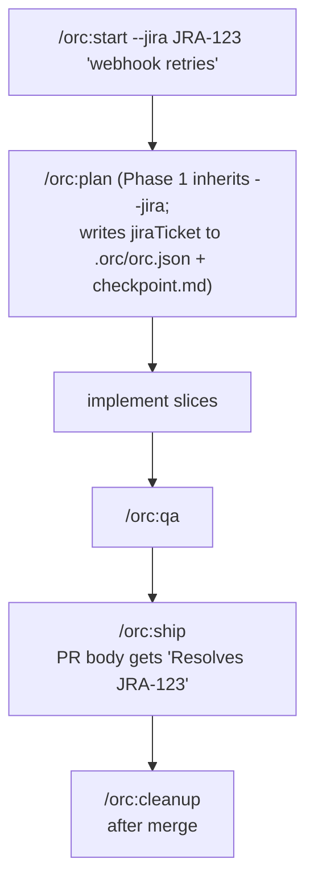

# 12 — Linking a Jira ticket and shipping with `Resolves <KEY>`

## Scenario

You've been handed Jira ticket `JRA-123` — *"webhook deliveries to enterprise tenants drop ~3% of payloads."* You want orc to:

1. Carry `JRA-123` through the work so `/orc:status` and `/orc:resume` show it.
2. Suggest a branch name like `feat/JRA-123-webhook-retries`.
3. Land `Resolves JRA-123` in the PR body automatically when you `/orc:ship`.
4. Optionally let you create a new Jira sub-task or link a related ticket without leaving the terminal.

This is the end-to-end Jira-aware feature flow. The same `jiraTicket` plumbing applies to `/orc:plan`, `/orc:debug`, and `/orc:flow`.

## Flow



## Walk-through

### Phase 1 — Start with a Jira flag

```
/orc:start --jira JRA-123 "implement webhook retries"
```

What happens:

1. `orc:using-git-worktrees` is invoked. `/orc:start` fetches the ticket summary via `acli jira workitem view JRA-123 --fields "summary" --json`, slugifies it, and proposes the branch name `feat/JRA-123-webhook-retries`. You can accept or override.
2. Worktree created at `.orc/.worktrees/orc/feat-JRA-123-webhook-retries/`. New branch `feat/JRA-123-webhook-retries` checked out.
3. `/orc:start` Phase 2 delegates to `/orc:plan`. Because `--jira JRA-123` was forwarded, `/orc:plan`'s Phase 1 prompt is **suppressed** — the link is set silently.
4. `.orc/feat-JRA-123-webhook-retries/files/checkpoint.md` is written with frontmatter:

   ```yaml
   ---
   phase: 1
   command: plan
   status: in_progress
   started_at: 2026-05-02T10:14:00Z
   branch: feat-JRA-123-webhook-retries
   jiraTicket: JRA-123
   ---
   ```

5. `.orc/orc.json` gets a registry entry with `"jiraTicket": "JRA-123"`.

### Phase 2 — Plan + first failing test

`/orc:plan` writes `.orc/<branch>/files/plan.md`. `orc:tdd` writes the first failing test. Same as any other `/orc:start` flow — the only difference is the ticket key trails along.

### Phase 3 — Implement

You implement slice-by-slice (or `/orc:flow --type=feature` does it autonomously via `orc-implementer`). Nothing Jira-specific here.

### Phase 4 — Status check (anytime)

```
/orc:status
```

Output now ends each session line with the bound ticket:

```
| 1 | start | feat-JRA-123-webhook-retries | 4/5 | in_progress | 2h ago | [JRA-123] |
```

### Phase 5 — QA + ship

```
/orc:qa
/orc:ship
```

`/orc:ship` Phase 4 (PR composition) reads the active session's `jiraTicket` from `.orc/orc.json`. If present, it appends to the PR body:

```
## Why
…

## What changed
…

## How tested
…

Resolves JRA-123
```

(GitHub's "smart commit" link semantics will close the linked Jira issue on PR merge if the org has the GitHub-Jira app installed. orc just emits the line; the integration is server-side.)

### Phase 6 — Cleanup

```
/orc:cleanup
```

Removes `.orc/feat-JRA-123-webhook-retries/`, the worktree, and (if merged) the local branch. The Jira ticket itself is untouched — orc never auto-transitions Jira state.

## Artifacts

```
.orc/feat-JRA-123-webhook-retries/files/
├── checkpoint.md              # frontmatter has jiraTicket: JRA-123
├── plan.md
├── progress.md
├── orc.json                   # session metadata, includes jiraTicket
└── (qa/ if web change)

.orc/orc.json
└── [{ … "branch": "feat-JRA-123-webhook-retries", "jiraTicket": "JRA-123", … }]
```

## Done when

- The PR is open AND the body contains `Resolves JRA-123`.
- `/orc:status` shows the session with `[JRA-123]` in the per-row line.
- Post-merge: `/orc:cleanup` ran. The bound ticket is forgotten only because the session entry is gone — that's intentional.

## Variants

- **You learned the Jira key after starting** — skip `--jira` on `/orc:start`. orc Phase 1 prompt asks once, you skip it. Later, run `/orc:jira bind JRA-123` to attach the key. From that point on, `/orc:status` and `/orc:ship` see it.
- **You don't have a ticket yet — create one first** — `/orc:jira create --summary "implement webhook retries" --project PLAT --type Story` returns a key (e.g. `PLAT-456`), prompts to bind it, then continue with `/orc:start --jira PLAT-456`.
- **Sub-task during implementation** — mid-flow you realize you need a child ticket. `/orc:jira subtask --summary "wire feature flag" --type Sub-task` defaults `--parent` to the bound `jiraTicket` (after confirming via `AskUserQuestion`).
- **Linking a related ticket** — `/orc:jira link --in PLAT-789 --type "Relates to"` defaults `--out` to the bound key. Same confirm-before-send pattern.
- **Bug flow** — same idea: `/orc:debug --jira BUG-42 "billing $NaN"` binds `BUG-42` to the diagnosis session; `/orc:ship` produces `Resolves BUG-42`.
- **`/orc:flow` end-to-end** — `/orc:flow --jira JRA-123 "implement webhook retries"` cascades the link through every phase. Identical behavior, fewer commands.

## Iron rules in play

- **#1 — No commits to main.** The worktree branch is enforced; the PreToolUse hook downgrades any commit to main to a confirm prompt.
- **#6 — No multi-phase work without `.orc/` checkpoints.** The `jiraTicket` field is part of the checkpoint contract — survives `/orc:resume`.
- **#5 — No AI attribution in PRs.** `Resolves JRA-123` is the only added trailer; no `Co-Authored-By` lines.
- **`/orc:jira` iron rule — `bind`/`unbind` require an active session.** No state mutation outside an in-progress orc workspace.
