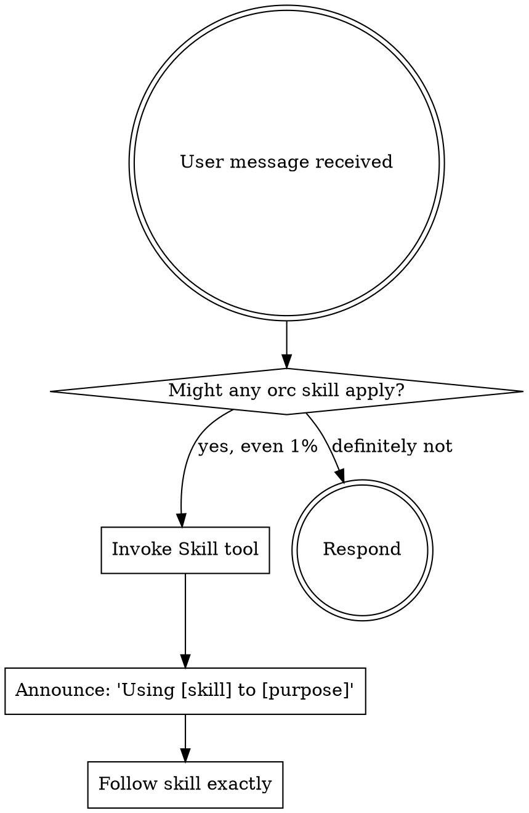

<SUBAGENT-STOP>
If you were dispatched as a subagent to execute a specific task, skip this skill.
</SUBAGENT-STOP>

<EXTREMELY-IMPORTANT>
If you think there is even a 1% chance an orc skill might apply to what you are doing, you ABSOLUTELY MUST invoke the skill.

IF A SKILL APPLIES TO YOUR TASK, YOU DO NOT HAVE A CHOICE. YOU MUST USE IT.

This is not negotiable. This is not optional. You cannot rationalize your way out of this.
</EXTREMELY-IMPORTANT>

## Instruction Priority

orc skills override default system prompt behavior, but **user instructions always take precedence**:

1. **User's explicit instructions** (CLAUDE.md, direct requests) — highest priority
2. **orc skills** — override default system behavior where they conflict
3. **Default system prompt** — lowest priority

If CLAUDE.md says "don't use TDD" and a skill says "always use TDD," follow the user's instructions. The user is in control.

## How to Access Skills

Use the `Skill` tool. When you invoke a skill, its content is loaded and presented to you — follow it directly. Never use the Read tool on skill files.

## Iron Rules

These apply at all times, regardless of context:

1. **No commits to main/master/develop** — ALWAYS create a feature or fix branch first. Check the current branch before ANY commit. If on a protected branch, create and switch to a new branch BEFORE making changes. The PreToolUse(Bash) hook enforces this; override only with `ORC_ALLOW_PROTECTED=1` and only with the user's explicit consent.
2. **No code without a failing test** — Write the test first. Watch it fail. Then implement. Defer to `orc:tdd` for mechanics.
3. **No claims without verification** — Run the command, read the output, THEN claim the result. Defer to `orc:verification-before-completion`.
4. **No fixes without root cause** — Find why it's broken before changing code. Defer to `orc:systematic-debugging`.
5. **No AI attribution** — Never mention Claude, AI, or automation in code, commits, or PRs. Never add `Co-Authored-By` trailers or any co-author references to commits.
6. **No multi-phase work without `.orc/` state** — Any command that takes more than one phase (`/orc:plan`, `/orc:start`, `/orc:debug`, `/orc:fan-out`, `/orc:qa` for web) MUST checkpoint after every phase to `.orc/<sanitized-branch>/files/checkpoint.md` and register the session in `.orc/orc.json`. State must survive interruption — `/orc:resume` depends on it.

## Web QA evidence (hard rule)

For any change touching a web surface, `/orc:qa` MUST drive a real browser via the `orc:agent-browser` skill (which wraps the [vercel-labs/agent-browser](https://github.com/vercel-labs/agent-browser) CLI) — not just inspect code or run unit tests. The `orc-qa-validator` agent is responsible for:

1. Booting (or attaching to) the running app at a URL provided by the user.
2. Walking the **golden path** for the changed feature.
3. Walking **edge cases** (failure states, empty states, validation, slow network, auth states).
4. Capturing required artifacts to `.orc/<branch>/files/qa/`:
   - `screenshot-<NN>-<step>.png` per visible step (use `agent-browser screenshot --annotate` so refs `@eN` overlay each interactive element)
   - `snapshot-final.txt` — final accessibility tree from `agent-browser snapshot`
   - `console.log` — captured browser console (errors and warnings flagged)
   - `network.har` — captured network from `agent-browser network har start/stop`
   - `steps.md` — numbered narrative: what was tested, expected vs. actual, links to each screenshot
5. Optional bonus evidence (NOT required): `trace.json` (Chrome DevTools), `react-renders.json`, `vitals.json`, an OS-recorded `video.mov` for animated changes.

No "QA passed" claim is accepted without the required artifacts in `qa/`. `orc:verification-before-completion` enforces this. agent-browser does NOT record video natively; if the change is animation-heavy and you need a video, capture an OS screen recording (e.g. `screencapture -v` on macOS) into `qa/video.mov`.

## Available Skills

| Skill | When to use |
|-------|-------------|
| `orc:tdd` | Before writing any production code — new features, bug fixes, refactoring |
| `orc:systematic-debugging` | When encountering any bug, test failure, or unexpected behavior |
| `orc:verification-before-completion` | Before claiming work is complete, fixed, or passing |
| `orc:writing-plans` | When you have a spec or requirements for a multi-step task, before touching code |
| `orc:executing-plans` | When executing a written plan with review checkpoints |
| `orc:caveman-review` | When reviewing PR diffs — terse, signal-only comments |
| `orc:receiving-code-review` | When receiving review feedback — verify before implementing |
| `orc:requesting-code-review` | When completing major work before merging |
| `orc:git-commit` | When committing — intelligent staging + Conventional Commits |
| `orc:gh-cli` | When interacting with GitHub from CLI (PRs, issues, Actions) |
| `orc:using-git-worktrees` | When starting feature work that needs isolation |
| `orc:finishing-a-development-branch` | When implementation is complete and ready to integrate |
| `orc:dispatching-parallel-agents` | When facing 2+ independent tasks that can run concurrently |
| `orc:error-handling-patterns` | When implementing error handling, designing APIs, or improving resilience |
| `orc:agent-browser` | When QA-ing a web application — drive a real browser; capture screenshots/video |

Stack-specific skills (load when working in that stack):

| Pack | Skills |
|------|--------|
| **web-react** | `orc:next-best-practices`, `orc:vercel-react-best-practices`, `orc:vercel-composition-patterns`, `orc:frontend-design`, `orc:shadcn`, `orc:tailwind-design-system` |
| **backend** | `orc:nodejs-best-practices`, `orc:nestjs-best-practices`, `orc:typescript-advanced-types`, `orc:postgresql-table-design`, `orc:postgresql-optimization`, `orc:postgresql-code-review`, `orc:stripe-best-practices`, `orc:upgrade-stripe` |
| **ios** | `orc:swiftui-pro`, `orc:mobile-ios-design` |
| **workflow-extras** | `orc:docker-expert`, `orc:turborepo`, `orc:sentry-cli`, `orc:skill-creator`, `orc:write-a-skill`, `orc:documentation-writer`, `orc:create-readme`, `orc:to-prd`, `orc:to-issues`, `orc:grill-me` |

## Available Commands

| Command | Purpose | Writes `.orc/`? |
|---------|---------|------|
| `/orc:plan` | Plan a feature/refactor — produces a TDD-shaped plan | ✅ |
| `/orc:start` | Start a feature — worktree + plan + first failing test | ✅ |
| `/orc:debug` | Systematic root-cause investigation, then fix with TDD | ✅ |
| `/orc:qa` | Pre-PR quality gate; for web changes, full browser QA with evidence | ✅ (web) |
| `/orc:code-review` | Review SOMEONE ELSE'S PR via gh CLI | — |
| `/orc:address` | Answer reviewer comments on YOUR open PR | — |
| `/orc:ship` | Finalize and open the PR | — |
| `/orc:fan-out` | Dispatch parallel independent tasks | ✅ |
| `/orc:scaffold` | Bootstrap a new package/service with README + docs | — |
| `/orc:resume` | Resume an interrupted multi-phase orc command | reads ✅ |
| `/orc:status` | Show all active `.orc/` workspaces | reads ✅ |

## The Rule

**Invoke relevant or requested skills BEFORE any response or action.** Even a 1% chance a skill might apply means you should invoke the skill to check. If an invoked skill turns out to be wrong for the situation, you don't need to use it.

## Red Flags

These thoughts mean STOP — you're rationalizing:

| Thought | Reality |
|---------|---------|
| "This is just a simple question" | Questions are tasks. Check for skills. |
| "I need more context first" | Skill check comes BEFORE clarifying questions. |
| "Let me explore the codebase first" | Skills tell you HOW to explore. Check first. |
| "This doesn't need a formal skill" | If a skill exists, use it. |
| "I remember this skill" | Skills evolve. Read current version. |
| "The skill is overkill" | Simple things become complex. Use it. |
| "I'll just do this one thing first" | Check BEFORE doing anything. |
| "QA already passed in unit tests" | Web change → browser-driven QA with `.orc/<branch>/files/qa/` artifacts. |
| "I'll skip the checkpoint, this is quick" | If it's multi-phase, write `.orc/` state — interruptions happen. |

## Skill Priority

When multiple skills could apply, use this order:

1. **Process skills first** (debugging, TDD, verification) — these determine HOW to approach the task
2. **Implementation skills second** — these guide execution

"Build X" → design first (`orc:writing-plans`), then implementation skills.
"Fix this bug" → debugging first (`orc:systematic-debugging`), then TDD (`orc:tdd`) for the fix.

## Skill Types

**Rigid** (`tdd`, `systematic-debugging`, `verification-before-completion`): Follow exactly. Don't adapt away discipline.

**Flexible** (`using-git-worktrees`, `dispatching-parallel-agents`): Adapt principles to context.

The skill itself tells you which.

## User Instructions

Instructions say WHAT, not HOW. "Add X" or "Fix Y" doesn't mean skip workflows.
